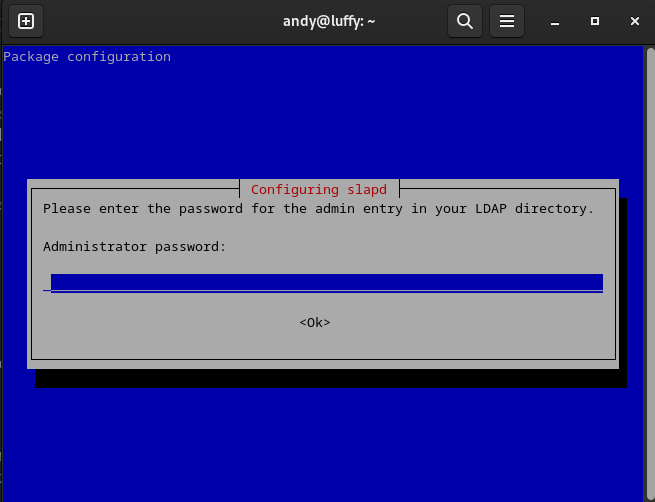
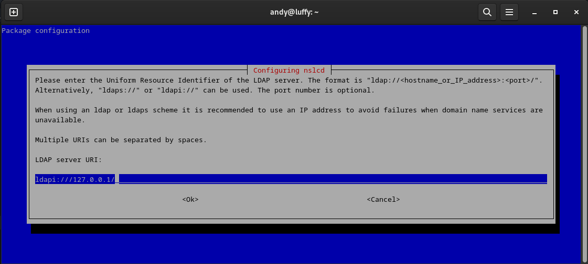
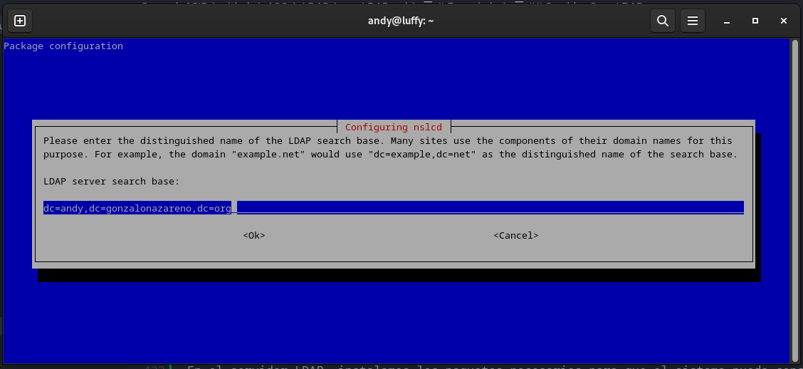
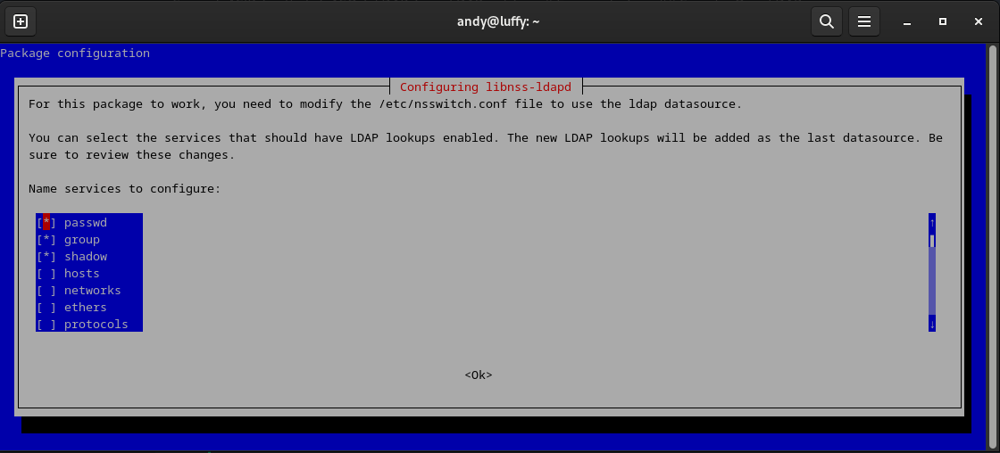
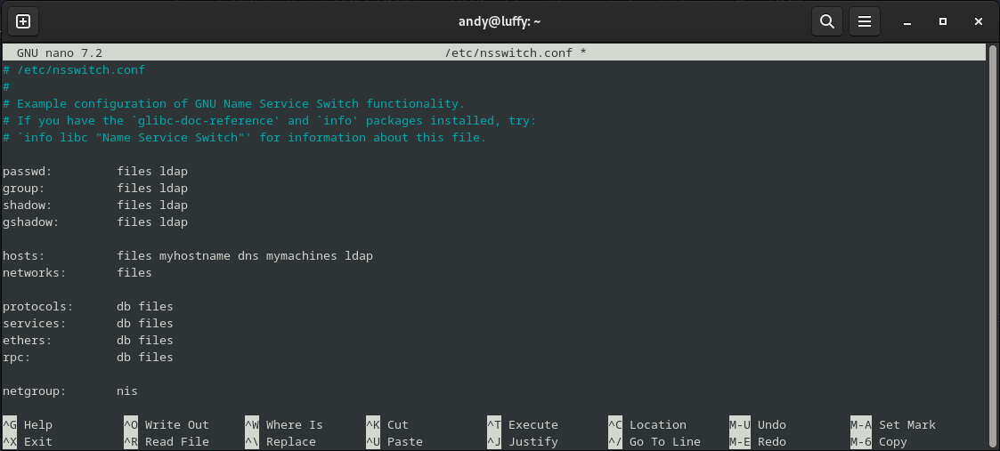
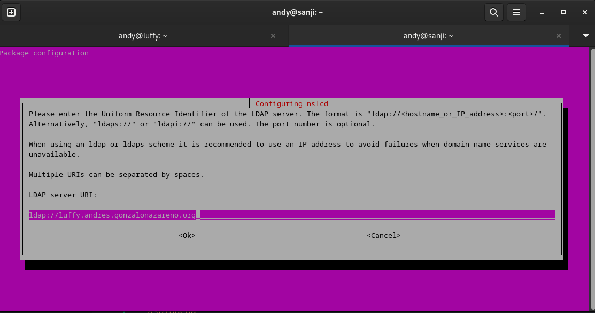
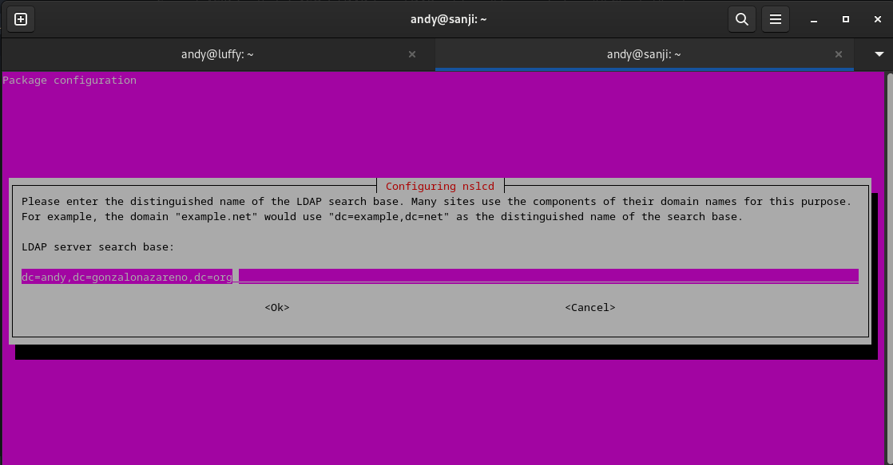
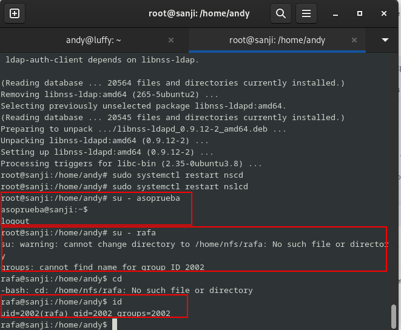

# Enunciado

Realiza la instalación y configuración básica de OpenLDAP en una unidad de tu escenario de OpenStack, utilizando como base el nombre DNS asignado de tu proyecto. Deberás crear un usuario llamado asoprueba y configurar una máquina cliente basada en Debian y Rocky para que pueda validarse en servidor ldap configurado anteriormente con el usuario asoprueba. la ubicación del los home de los diferentes usuarios estarán ubicados en un servidor nfs.

Esa práctica la vamos a dividir en un **ServidorLDAP** y dos clientes.

## Servidor OpenLDAP

Lo primero que vamos a instalar y hacer la configfuracion será en nuestro maquian que actuará como server, en este caso `luffy`.

Por lo que lo primero que haremos sera ver cual es su nombre correcto y completo **(FQDN)**, por lo que haremos lo siguiente:

```bash
andy@luffy:~$ hostname -f
luffy.andy.gonzalonazareno.org
```
y ahora lo que harenso sera instalr **OpenLDAP**, con lo que me ayudare del siguiente comando:

```bash
andy@luffy:~$ sudo apt install slapd -y
```



Durante la instalación, se nos pedirá que introduzcamos una contraseña para el usuario administrador del servicio (**usuario** es mi contraseña). Es importante recordar esta contraseña, ya que la usaremos más adelante para gestionar nuestro directorio LDAP.

Una vez finalizada la instalación, verificamos que OpenLDAP está escuchando en el puerto TCP 389, que es el puerto estándar para este servicio:

```bash
andy@luffy:~$ sudo netstat -tlnp | egrep slap
tcp        0      0 0.0.0.0:389             0.0.0.0:*               LISTEN      47103/slapd         
tcp6       0      0 :::389                  :::*                    LISTEN      47103/slapd     
```
Como podemos observar va viento en popa a toda vela, ya que nos indica que el servicio **OpensLDAP** esta escuchando por el puesto `389`.

Ahora instalamos las herramientas adicionales que nos permitirán gestionar el directorio LDAP de manera más sencilla:

```bash
andy@luffy:~$ sudo apt install ldap-utils
Reading package lists... Done
Building dependency tree... Done
Reading state information... Done
ldap-utils is already the newest version (2.5.13+dfsg-5).
ldap-utils set to manually installed.
0 upgraded, 0 newly installed, 0 to remove and 1 not upgraded.
```
Una vez instaladas, podemos probar si el servicio funciona correctamente ejecutando una consulta de prueba con el comando ldapsearch. Para ello, usamos el siguiente comando con nuestro propio dominio:

```bash
andy@luffy:~$ ldapsearch -x -D "cn=admin,dc=andy,dc=gonzalonazareno,dc=org" -b "dc=andy,dc=gonzalonazareno,dc=org" -W
```

y nos da esto por pantalla:

```bash
andy@luffy:~$ ldapsearch -x -D "cn=admin,dc=andy,dc=gonzalonazareno,dc=org" -b "dc=andy,dc=gonzalonazareno,dc=org" -W
Enter LDAP Password: 
# extended LDIF
#
# LDAPv3
# base <dc=andy,dc=gonzalonazareno,dc=org> with scope subtree
# filter: (objectclass=*)
# requesting: ALL
#

# andy.gonzalonazareno.org
dn: dc=andy,dc=gonzalonazareno,dc=org
objectClass: top
objectClass: dcObject
objectClass: organization
o: andy.gonzalonazareno.org
dc: andy

# search result
search: 2
result: 0 Success

# numResponses: 2
# numEntries: 1
```

Nos pedirá la contraseña del usuario administrador que configuramos durante la instalación. Si la autenticación es correcta, veremos un listado de las entradas en nuestro directorio LDAP, lo que confirma que el servidor está funcionando.

Para mantener una estructura organizada en nuestro directorio LDAP, vamos a crear unidades organizativas (OUs) que nos permitirán clasificar los objetos de manera más ordenada.

```bash
andy@luffy:~$ cat UnidadesOrganizativas.ldif
dn: ou=Personas,dc=andy,dc=gonzalonazareno,dc=org
objectClass: top
objectClass: organizationalUnit
ou: Personas

dn: ou=Grupos,dc=andy,dc=gonzalonazareno,dc=org
objectClass: top
objectClass: organizationalUnit
ou: Gruposª
```

Aquí estamos definiendo dos unidades organizativas:

- `ou=Personas`: Donde almacenaremos las cuentas de usuario.
- `ou=Grupos`: Donde gestionaremos los diferentes grupos de usuarios.

Ahora, añadimos esta configuración a nuestro servidor LDAP con el siguiente comando:

```bash
andy@luffy:~$ ldapadd -x -D "cn=admin,dc=andy,dc=gonzalonazareno,dc=org" -f UnidadesOrganizativas.ldif -W
Enter LDAP Password: 
adding new entry "ou=Personas,dc=andy,dc=gonzalonazareno,dc=org"

adding new entry "ou=Grupos,dc=andy,dc=gonzalonazareno,dc=org"
```

Nos pedirá la contraseña del usuario administrador (cn=admin). Si el proceso se completa correctamente(como podemos observar), las unidades organizativas se habrán añadido al directorio.

Para confirmar que las OUs se han creado correctamente, realizamos una búsqueda en LDAP:

```bash
andy@luffy:~$ ldapsearch -x -b dc=andy,dc=gonzalonazareno,dc=org
# extended LDIF
#
# LDAPv3
# base <dc=andy,dc=gonzalonazareno,dc=org> with scope subtree
# filter: (objectclass=*)
# requesting: ALL
#

# andy.gonzalonazareno.org
dn: dc=andy,dc=gonzalonazareno,dc=org
objectClass: top
objectClass: dcObject
objectClass: organization
o: andy.gonzalonazareno.org
dc: andy

# Personas, andy.gonzalonazareno.org
dn: ou=Personas,dc=andy,dc=gonzalonazareno,dc=org
objectClass: top
objectClass: organizationalUnit
ou: Personas

# Grupos, andy.gonzalonazareno.org
dn: ou=Grupos,dc=andy,dc=gonzalonazareno,dc=org
objectClass: top
objectClass: organizationalUnit
ou:: R3J1cG9zwqo=
ou: Grupos

# search result
search: 2
result: 0 Success

# numResponses: 4
# numEntries: 3
```

Para gestionar correctamente a los usuarios, creamos un grupo específico llamado `asoprueba`. Para ello, generamos un archivo llamado `grupos.ldif` con el siguiente contenido:

```bash
andy@luffy:~$ cat grupos.ldif
dn: cn=asoprueba,ou=Grupos,dc=andy,dc=gonzalonazareno,dc=org
objectClass: top
objectClass: posixGroup
gidNumber: 2001
cn: asoprueba
```

Este grupo se define con la clase posixGroup, que es necesaria para la autenticación en sistemas basados en UNIX. El atributo gidNumber (2001) representa el identificador único del grupo.

Ahora, lo agregamos al directorio LDAP con el siguiente comando:

```bash
andy@luffy:~$ ldapadd -x -D 'cn=admin,dc=andy,dc=gonzalonazareno,dc=org' -W -f grupos.ldif
Enter LDAP Password: 
adding new entry "cn=asoprueba,ou=Grupos,dc=andy,dc=gonzalonazareno,dc=org"

andy@luffy:~$ 
```

Para verificar que el grupo se ha creado correctamente, realizamos una consulta LDAP:

```bash
andy@luffy:~$ ldapsearch -x -b dc=andy,dc=gonzalonazareno,dc=org
# extended LDIF
#
# LDAPv3
# base <dc=andy,dc=gonzalonazareno,dc=org> with scope subtree
# filter: (objectclass=*)
# requesting: ALL
#

# andy.gonzalonazareno.org
dn: dc=andy,dc=gonzalonazareno,dc=org
objectClass: top
objectClass: dcObject
objectClass: organization
o: andy.gonzalonazareno.org
dc: andy

# Personas, andy.gonzalonazareno.org
dn: ou=Personas,dc=andy,dc=gonzalonazareno,dc=org
objectClass: top
objectClass: organizationalUnit
ou: Personas

# Grupos, andy.gonzalonazareno.org
dn: ou=Grupos,dc=andy,dc=gonzalonazareno,dc=org
objectClass: top
objectClass: organizationalUnit
ou:: R3J1cG9zwqo=
ou: Grupos

# asoprueba, Grupos, andy.gonzalonazareno.org
dn: cn=asoprueba,ou=Grupos,dc=andy,dc=gonzalonazareno,dc=org
objectClass: top
objectClass: posixGroup
gidNumber: 2001
cn: asoprueba

# search result
search: 2
result: 0 Success

# numResponses: 5
# numEntries: 4
```

Aquí vemos como en el parrafo este vemos que aparce en la salida.

```bash
# asoprueba, Grupos, andy.gonzalonazareno.org
dn: cn=asoprueba,ou=Grupos,dc=andy,dc=gonzalonazareno,dc=org
objectClass: top
objectClass: posixGroup
gidNumber: 2001
cn: asoprueba
```

Como vemos que se ha generado, eso significa que se ha aplicado correctamente.

Por lo que antes de crear el usuario, generamos una contraseña cifrada usando el comando slappasswd:

```bash
andy@luffy:~$ sudo slappasswd 
New password: 
Re-enter new password: 
{SSHA}NrS8xG+eLYA2Zc6N06Tj3LyrFwN08lBy
```

La contraseña es **narnia**.

Ahora procedemos a hacer un archivo `usuarios.ldif` con el siguiente contenido.

```bash 
andy@luffy:~$ cat usuarios.ldif
dn: uid=asoprueba,ou=Personas,dc=andy,dc=gonzalonazareno,dc=org
objectClass: top
objectClass: posixAccount
objectClass: inetOrgPerson
objectClass: person
cn: asoprueba
uid: asoprueba
uidNumber: 2001
gidNumber: 2001
homeDirectory: /home/nfs/asoprueba
loginShell: /bin/bash
userPassword: {SSHA}NrS8xG+eLYA2Zc6N06Tj3LyrFwN08lBy
sn: asoprueba
mail: asirandyglez@gmail.com
givenName: asoprueba

```

Donde:

- `uid`=asoprueba: Identificador único del usuario.
- `objectClass`: Tipos de objetos que permiten definir atributos específicos:
- `posixAccount`: Para autenticación en sistemas UNIX.
- `inetOrgPerson y person`: Para definir atributos personales.
- `uidNumber=2001 y gidNumber=2001`: Identificadores del usuario y grupo.
- `homeDirectory=/home/nfs/asoprueba`: Directorio personal del usuario, que estará ubicado en un servidor NFS.
- `loginShell=/bin/bash`: Shell asignado al usuario.
- `userPassword`: Contraseña cifrada generada con slappasswd.
- `mail`: Dirección de correo del usuario

Ahora lo que hacemos es añadir este usuario al directorio:

```bash
andy@luffy:~$ ldapadd -x -D 'cn=admin,dc=andy,dc=gonzalonazareno,dc=org' -W -f usuarios.ldif
                     
Enter LDAP Password:                                                           
adding new entry "uid=asoprueba,ou=Personas,dc=andy,dc=gonzalonazareno,dc=org"
```

Y lo que hacemos es verificar:

```bash
andy@luffy:~$ ldapsearch -x -b dc=andy,dc=gonzalonazareno,dc=org
# extended LDIF
#
# LDAPv3
# base <dc=andy,dc=gonzalonazareno,dc=org> with scope subtree
# filter: (objectclass=*)
# requesting: ALL
#

# andy.gonzalonazareno.org
dn: dc=andy,dc=gonzalonazareno,dc=org
objectClass: top
objectClass: dcObject
objectClass: organization
o: andy.gonzalonazareno.org
dc: andy

# Personas, andy.gonzalonazareno.org
dn: ou=Personas,dc=andy,dc=gonzalonazareno,dc=org
objectClass: top
objectClass: organizationalUnit
ou: Personas

# Grupos, andy.gonzalonazareno.org
dn: ou=Grupos,dc=andy,dc=gonzalonazareno,dc=org
objectClass: top
objectClass: organizationalUnit
ou:: R3J1cG9zwqo=
ou: Grupos

# asoprueba, Grupos, andy.gonzalonazareno.org
dn: cn=asoprueba,ou=Grupos,dc=andy,dc=gonzalonazareno,dc=org
objectClass: top
objectClass: posixGroup
gidNumber: 2001
cn: asoprueba

# asoprueba, Personas, andy.gonzalonazareno.org
dn: uid=asoprueba,ou=Personas,dc=andy,dc=gonzalonazareno,dc=org
objectClass: top
objectClass: posixAccount
objectClass: inetOrgPerson
objectClass: person
cn: asoprueba
uid: asoprueba
uidNumber: 2001
gidNumber: 2001
homeDirectory: /home/nfs/asoprueba
loginShell: /bin/bash
sn: asoprueba
mail: asirandyglez@gmail.com
givenName: asoprueba

# search result
search: 2
result: 0 Success

# numResponses: 6
# numEntries: 5
```

Y lo podemos ver en este trozo:

```bash
# asoprueba, Personas, andy.gonzalonazareno.org
dn: uid=asoprueba,ou=Personas,dc=andy,dc=gonzalonazareno,dc=org
objectClass: top
objectClass: posixAccount
objectClass: inetOrgPerson
objectClass: person
cn: asoprueba
uid: asoprueba
uidNumber: 2001
gidNumber: 2001
homeDirectory: /home/nfs/asoprueba
loginShell: /bin/bash
sn: asoprueba
mail: asirandyglez@gmail.com
givenName: asoprueba
```

Como podemos ver los datos del usuario **asoprueba**, podemos deducir qe la configuiracion se ha aplicado perfectamente.

El usuario asoprueba no podrá acceder a su cuenta si su directorio de inicio no existe. Para crearlo, ejecutamos:

```bash
andy@luffy:~$ sudo mkdir -p /home/nfs/asoprueba
andy@luffy:~$ sudo chown 2001:2001 /home/nfs/asoprueba
andy@luffy:~$ ls -l /home/nfs/
total 4
drwxr-xr-x 2 2001 2001 4096 Mar 31 14:53 asoprueba
andy@luffy:~$ 
```

Esto crea el directorio `/home/nfs/asoprueba` y asigna los permisos correctos al usuario (uid=2001, gid=2001).

Modificamos `/etc/exports` para permitir que el usuario asoprueba acceda a su directorio de inicio a través de NFS. Añadimos la siguiente línea:

```bash
andy@luffy:~$ cat /etc/exports
# /etc/exports: the access control list for filesystems which may be exported
#		to NFS clients.  See exports(5).
#
# Example for NFSv2 and NFSv3:
# /srv/homes       hostname1(rw,sync,no_subtree_check) hostname2(ro,sync,no_subtree_check)
#
# Example for NFSv4:
# /srv/nfs4        gss/krb5i(rw,sync,fsid=0,crossmnt,no_subtree_check)
# /srv/nfs4/homes  gss/krb5i(rw,sync,no_subtree_check)
#

/home/nfs       *(rw,fsid=0,subtree_check)

```

Luego, creamos un directorio de prueba:
```bash
andy@luffy:~$ sudo mkdir /home/nfs/prueba
```
Y reiniciamos el servicio NFS para aplicar los cambios:
```bash
andy@luffy:~$ sudo /etc/init.d/nfs-kernel-server restart
Restarting nfs-kernel-server (via systemctl): nfs-kernel-server.service.
```

En el servidor LDAP, instalamos los paquetes necesarios para que el sistema pueda consultar la base de datos LDAP:

```bash
andy@luffy:~$ sudo apt-get install libpam-ldapd libpam-ldap nscd libnss-ldap -y
```
Y ahora nos saldrán las siguienets pantallas:



También se nos solicitarán credenciales, donde usaremos dc=andy,dc=gonzalonazareno,dc=org.




Y enl aisguiente pantalla marcamos las opciones que nos haran falta:



Modificamos `/etc/nsswitch.conf` para que el sistema utilice LDAP para resolver usuarios y grupos. Editamos el archivo y nos aseguramos de que tenga estas líneas:



Y ahora comprobamos que el sistema puede obtener la infromacion del usuario `asoprueba`:

```bash
andy@luffy:~$ id asoprueba 
uid=2001(asoprueba) gid=2001(asoprueba) groups=2001(asoprueba)
andy@luffy:~$ 
```

Finalmente, intentamos iniciar sesión con asoprueba para verificar que todo funciona correctamente:

```bash
andy@luffy:~$ id asoprueba 
uid=2001(asoprueba) gid=2001(asoprueba) groups=2001(asoprueba)
andy@luffy:~$ sudo su
root@luffy:/home/andy# login asoprueba
Password: 

Login incorrect
luffy login: narnia
Password: 
root@luffy:/home/andy# login asoprueba
Password: 
Linux luffy 6.1.0-31-amd64 #1 SMP PREEMPT_DYNAMIC Debian 6.1.128-1 (2025-02-07) x86_64

The programs included with the Debian GNU/Linux system are free software;
the exact distribution terms for each program are described in the
individual files in /usr/share/doc/*/copyright.

Debian GNU/Linux comes with ABSOLUTELY NO WARRANTY, to the extent
permitted by applicable law.
asoprueba@luffy:~$ 
```

Hubo un par de intentos porque me confundí de contraseña.

## Cliente Ubuntu.

Para este paso usaremos a Sanji, por lo que lo primero que harmeos r instalar los paquetes necesarios para trabajar LDAP.

```bash
andy@sanji:~$ sudo apt install ldap-utils -y
```

Luego, pasamos a configurar el archivo de configuración del cliente LDAP, añadiendo las dos últimas líneas correspondientes. El contenido del archivo `/etc/ldap/ldap.conf` debe ser similar al siguiente:

```bash
andy@sanji:~$ cat /etc/ldap/ldap.conf 
#
# LDAP Defaults
#

# See ldap.conf(5) for details
# This file should be world readable but not world writable.

#BASE	dc=example,dc=com
#URI	ldap://ldap.example.com ldap://ldap-provider.example.com:666

#SIZELIMIT	12
#TIMELIMIT	15
#DEREF		never

# TLS certificates (needed for GnuTLS)
TLS_CACERT	/etc/ssl/certs/ca-certificates.crt

BASE dc=andy,dc=gonzalonazareno,dc=org
URI ldap://luffy.andres.gonzalonazareno.org
```

Una vez que hemos realizado esta configuración, probamos que el servicio LDAP está funcionando correctamente ejecutando el siguiente comando:

```bash
andy@sanji:~$ ldapsearch -x -b dc=andy,dc=gonzalonazareno,dc=org
# extended LDIF
#
# LDAPv3
# base <dc=andy,dc=gonzalonazareno,dc=org> with scope subtree
# filter: (objectclass=*)
# requesting: ALL
#

# andy.gonzalonazareno.org
dn: dc=andy,dc=gonzalonazareno,dc=org
objectClass: top
objectClass: dcObject
objectClass: organization
o: andy.gonzalonazareno.org
dc: andy

# Personas, andy.gonzalonazareno.org
dn: ou=Personas,dc=andy,dc=gonzalonazareno,dc=org
objectClass: top
objectClass: organizationalUnit
ou: Personas

# Grupos, andy.gonzalonazareno.org
dn: ou=Grupos,dc=andy,dc=gonzalonazareno,dc=org
objectClass: top
objectClass: organizationalUnit
ou:: R3J1cG9zwqo=
ou: Grupos

# asoprueba, Grupos, andy.gonzalonazareno.org
dn: cn=asoprueba,ou=Grupos,dc=andy,dc=gonzalonazareno,dc=org
objectClass: top
objectClass: posixGroup
gidNumber: 2001
cn: asoprueba

# asoprueba, Personas, andy.gonzalonazareno.org
dn: uid=asoprueba,ou=Personas,dc=andy,dc=gonzalonazareno,dc=org
objectClass: top
objectClass: posixAccount
objectClass: inetOrgPerson
objectClass: person
cn: asoprueba
uid: asoprueba
uidNumber: 2001
gidNumber: 2001
homeDirectory: /home/nfs/asoprueba
loginShell: /bin/bash
sn: asoprueba
mail: asirandyglez@gmail.com
givenName: asoprueba

# search result
search: 2
result: 0 Success

# numResponses: 6
# numEntries: 5
```

y como podemos ver esta tdodo funcionando correctamente, pero tambien podemos verificar la conexion usando el usuario **asorpueba**

```bash
andy@sanji:~$ ldapwhoami -x -D "uid=asoprueba,ou=Personas,dc=andy,dc=gonzalonazareno,dc=org" -W
Enter LDAP Password: 
dn:uid=asoprueba,ou=Personas,dc=andy,dc=gonzalonazareno,dc=org
```

A continuación, instalamos los paquetes adicionales necesarios para la integración con el sistema. Usamos el siguiente comando para instalarlos:





Y luego editamos el archivo `/etc/nsswitch.conf`

```bash
andy@sanji:~$ cat /etc/nsswitch.conf
# /etc/nsswitch.conf
#
# Example configuration of GNU Name Service Switch functionality.
# If you have the `glibc-doc-reference' and `info' packages installed, try:
# `info libc "Name Service Switch"' for information about this file.

passwd:         files systemd ldap	
group:          files systemd ldap
shadow:         files ldap
gshadow:        files ldap 

hosts:          files dns
networks:       files

protocols:      db files
services:       db files
ethers:         db files
rpc:            db files

netgroup:       nis
```
Una vez realizados estos cambios, reiniciamos el servicio nscd para que el sistema pueda acceder correctamente al servidor LDAP al usar el comando login. El comando para reiniciar el servicio es:

`sudo service nscd restart`

Para montar la carpeta de inicio del usuario asoprueba, necesitamos instalar el paquete que nos permita utilizar NFS como cliente. El comando para instalar el paquete es:

`sudo apt install -y nfs-common`

A continuación, activamos el servicio nfs-client con los siguientes comandos:
```bash
andy@sanji:~$ sudo systemctl start nfs-client.target
andy@sanji:~$ sudo systemctl enable nfs-client.target
```

Luego, creamos los directorios de montaje necesarios para acceder al directorio de inicio del usuario asoprueba. Usamos los siguientes comandos para hacerlo:

A continuación, cargamos el módulo NFS en el sistema ejecutando el siguiente comando:

```bash
root@sanji:/home/andy# echo NFS | tee -s /etc/mod
modprobe.d/     modules         modules-load.d/ 
root@sanji:/home/andy# echo NFS | tee -s /etc/modules
tee: invalid option -- 's'
Try 'tee --help' for more information.
root@sanji:/home/andy# echo NFS | tee -a /etc/modules
NFS
```

Creamos una unidad systemd para montar el directorio utilizando NFS. El archivo de la unidad debería tener el siguiente contenido:

```bash
andy@sanji:~$ cat /etc/systemd/system/home-nfs.mount
[Unit]
Description=Montaje NFS
Requires=network-online.target
After=network-online.target
[Mount]
What=192.168.0.1:/home/nfs
Where=/home/nfs
Options=_netdev,auto
Type=nfs
[Install]
WantedBy=multi-user.target
```
Y renicio el sistema y veo el estado:

```bash
andy@sanji:~$ sudo systemctl restart home-nfs.mount
^[[A^[[Aandy@sanji:~$ sudo systemctl status home-nfs.mount
● home-nfs.mount - Montaje NFS
     Loaded: loaded (/etc/systemd/system/home-nfs.mount; disabled; vendor preset: enabled)
     Active: active (mounted) since Mon 2025-03-31 15:39:49 UTC; 7s ago
      Where: /home/nfs
       What: 192.168.0.1:/home/nfs
      Tasks: 0 (limit: 2314)
     Memory: 72.0K
        CPU: 43ms
     CGroup: /system.slice/home-nfs.mount

Mar 31 15:39:48 sanji systemd[1]: Mounting Montaje NFS...
Mar 31 15:39:49 sanji mount[7008]: Created symlink /run/systemd/system/remote-fs.target.wants/rpc-statd.service → /lib/systemd/system/rpc>
Mar 31 15:39:49 sanji systemd[1]: Mounted Montaje NFS.
```

Después de crear la unidad, verificamos que todo esté funcionando correctamente. Usamos el comando `df -h` para comprobar que el directorio se ha montado correctamente.

```bash
andy@sanji:~$ df -h
Filesystem             Size  Used Avail Use% Mounted on
/dev/vda1               15G  5.3G  8.7G  38% /
none                   492K  4.0K  488K   1% /dev
tmpfs                  984M     0  984M   0% /dev/shm
tmpfs                  394M  160K  394M   1% /run
tmpfs                  5.0M     0  5.0M   0% /run/lock
tmpfs                  197M     0  197M   0% /run/user/1001
192.168.0.1:/home/nfs   15G  5.3G  8.7G  38% /home/nfs
andy@sanji:~$ 
```

Y para que podamos entar en los usuarios pertinentes desde el cliente al servidor **LDAP**, tendremos que instalar el siguiente paquete:

```bash
root@sanji:/home/andy# sudo apt install libnss-ldapd -y
```

Y en la siguiente imagen podemos corroborar que hemos podido entrar:



## Cliente Rocky

Lo primero que necesitamos hacer es instalar el paquete openldap-clients junto con otros paquetes necesarios para que podamos conectarnos al servidor LDAP y verificar que todo funcione correctamente. Para ello, ejecutamos el siguiente comando:

Vamos a trabajar en **zoro**:

```bash
[andy@zoro ~]$ sudo dnf install openldap-clients sssd sssd-ldap oddjob-mkhomedir sssd-tools -y
```

A continuación, editamos el archivo /etc/pam.d/system-auth y añadimos la línea correspondiente para que el sistema gestione correctamente las sesiones de usuario.

```bash
[andy@zoro ~]$ sudo nano /etc/pam.d/system-auth
[andy@zoro ~]$ cat /etc/pam.d/system-auth 
#%PAM-1.0
# This file is auto-generated.
# User changes will be destroyed the next time authselect is run.
auth        required      pam_env.so
auth        sufficient    pam_unix.so try_first_pass nullok
auth        required      pam_deny.so

account     required      pam_unix.so

password    requisite     pam_pwquality.so try_first_pass local_users_only retry=3 authtok_type=
password    sufficient    pam_unix.so try_first_pass use_authtok nullok sha512 shadow
password    required      pam_deny.so

session     optional      pam_keyinit.so revoke
session     required      pam_limits.so
-session     optional      pam_systemd.so
session     [success=1 default=ignore] pam_succeed_if.so service in crond quiet use_uid
session     required      pam_unix.so
auth        sufficient    pam_ldap.so
```
He añadido: `auth        sufficient    pam_ldap.so`

Ahora, creamos un archivo de configuración llamado /etc/openldap/ldap.conf, en el cual especificamos la base y la URI para que el cliente pueda conectarse al servidor LDAP. Este archivo debería tener el siguiente contenido:

```bash
[andy@zoro ~]$ cat /etc/openldap/ldap.conf 
#
# LDAP Defaults
#

# See ldap.conf(5) for details
# This file should be world readable but not world writable.

#BASE	dc=example,dc=com
#URI	ldap://ldap.example.com ldap://ldap-master.example.com:666

#SIZELIMIT	12
#TIMELIMIT	15
#DEREF		never

# When no CA certificates are specified the Shared System Certificates
# are in use. In order to have these available along with the ones specified
# by TLS_CACERTDIR one has to include them explicitly:
#TLS_CACERT	/etc/pki/tls/cert.pem

# System-wide Crypto Policies provide up to date cipher suite which should
# be used unless one needs a finer grinded selection of ciphers. Hence, the
# PROFILE=SYSTEM value represents the default behavior which is in place
# when no explicit setting is used. (see openssl-ciphers(1) for more info)
#TLS_CIPHER_SUITE PROFILE=SYSTEM

# Turning this off breaks GSSAPI used with krb5 when rdns = false
SASL_NOCANON	on

BASE dc=andy,dc=gonzalonazareno,dc=org
URI ldap://luffy.andres.gonzalonazareno.org
```

De nuevo, editamos el archivo /etc/pam.d/system-auth y añadimos la siguiente línea:


```bash
session required pam_mkhomedir.so skel=/etc/skel umask=0022
```
Esto lo que nos va a permitir es la creacion automatica del directorio home cuando el usuario se conecte por primera vez.

Y ya qu elo configuramos, vamos a probar que funcione:

```bash
[andy@zoro ~]$ ldapsearch -x -b dc=andy,dc=gonzalonazareno,dc=org
# extended LDIF
#
# LDAPv3
# base <dc=andy,dc=gonzalonazareno,dc=org> with scope subtree
# filter: (objectclass=*)
# requesting: ALL
#

# andy.gonzalonazareno.org
dn: dc=andy,dc=gonzalonazareno,dc=org
objectClass: top
objectClass: dcObject
objectClass: organization
o: andy.gonzalonazareno.org
dc: andy

# Personas, andy.gonzalonazareno.org
dn: ou=Personas,dc=andy,dc=gonzalonazareno,dc=org
objectClass: top
objectClass: organizationalUnit
ou: Personas

# Grupos, andy.gonzalonazareno.org
dn: ou=Grupos,dc=andy,dc=gonzalonazareno,dc=org
objectClass: top
objectClass: organizationalUnit
ou:: R3J1cG9zwqo=
ou: Grupos

# asoprueba, Grupos, andy.gonzalonazareno.org
dn: cn=asoprueba,ou=Grupos,dc=andy,dc=gonzalonazareno,dc=org
objectClass: top
objectClass: posixGroup
gidNumber: 2001
cn: asoprueba

# asoprueba, Personas, andy.gonzalonazareno.org
dn: uid=asoprueba,ou=Personas,dc=andy,dc=gonzalonazareno,dc=org
objectClass: top
objectClass: posixAccount
objectClass: inetOrgPerson
objectClass: person
cn: asoprueba
uid: asoprueba
uidNumber: 2001
gidNumber: 2001
homeDirectory: /home/nfs/asoprueba
loginShell: /bin/bash
sn: asoprueba
mail: asirandyglez@gmail.com
givenName: asoprueba

# search result
search: 2
result: 0 Success

# numResponses: 6
# numEntries: 5
[andy@zoro ~]$ 
```

Y ademas comprobamos la conexión con el suario asoprueba.

```bash
[andy@zoro ~]$ ldapwhoami -x -D "uid=asoprueba,ou=Personas,dc=andy,dc=gonzalonazareno,dc=org" -W
Enter LDAP Password: 
dn:uid=asoprueba,ou=Personas,dc=andy,dc=gonzalonazareno,dc=org
```

Para que el inicio de sesión al servidor LDAP funcione correctamente, instalamos sssd y sssd-ldap, y después creamos un archivo de configuración llamado /etc/sssd/sssd.conf. Este archivo contiene los parámetros necesarios para que el sistema se comunique correctamente con el servidor LDAP. El contenido de este archivo es el siguiente:

```bash
[andy@zoro ~]$ sudo cat /etc/sssd/sssd.conf
[domain/default]
id_provider = ldap
autofs_provider = ldap
auth_provider = ldap
chpass_provider = ldap
ldap_uri = ldap://luffy.andres.gonzalonazareno.org
ldap_search_base = dc=andy,dc=gonzalonazareno,dc=org
ldap_id_use_start_tls = True
ldap_tls_cacertdir = /etc/openldap/cacerts
cache_credentials = True
ldap_tls_reqcert = allow

[sssd]
services = nss, pam, autofs
domains = default

[nss]
homedir_substring = /home/nfs
```

Una vez creado este archivo, cambiamos los permisos para asegurar que sea accesible solo por el administrador, y luego habilitamos y reiniciamos el servicio sssd con los siguientes comandos:

```bash
[andy@zoro ~]$ sudo chmod 600 /etc/sssd/sssd.conf
[andy@zoro ~]$ sudo systemctl restart sssd
[andy@zoro ~]$ sudo systemctl enable sssd
```

Después, creamos el directorio /home/nfs y asignamos la propiedad al usuario asoprueba con los siguientes comandos:

```bash
[andy@zoro ~]$ sudo cat /etc/systemd/system/home-nfs.mount
[Unit]
Description=Montaje NFS
Requires=NetworkManager.service
After=NetworkManager.service
[Mount]
What=172.16.1.94:/home/nfs
Where=/home/nfs
Options=_netdev,auto
Type=nfs
[Install]
WantedBy=multi-user.target
```

Activamos el servicio correspondiente para asegurar que se ejecute correctamente y que se monte el directorio en el arranque del sistema:

```bash
[andy@zoro ~]$ sudo systemctl daemon-reload
[andy@zoro ~]$ sudo systemctl start home-nfs.mount
[andy@zoro ~]$ sudo systemctl enable home-nfs.mount
Created symlink /etc/systemd/system/multi-user.target.wants/home-nfs.mount → /etc/systemd/system/home-nfs.mount.
[andy@zoro ~]$ 
```

Para verificar que el directorio se haya montado correctamente, usamos el comando df -h y comprobamos si el sistema muestra el directorio de montaje.

```bash
[andy@zoro ~]$ df -h
Filesystem             Size  Used Avail Use% Mounted on
devtmpfs               4.0M     0  4.0M   0% /dev
tmpfs                  888M     0  888M   0% /dev/shm
tmpfs                  355M  540K  355M   1% /run
/dev/vda4               14G  1.9G   13G  14% /
/dev/vda3              936M  545M  392M  59% /boot
/dev/vda2              100M  7.0M   93M   8% /boot/efi
tmpfs                  178M     0  178M   0% /run/user/1000
172.16.1.94:/home/nfs   15G  5.3G  8.7G  38% /home/nfs
```
