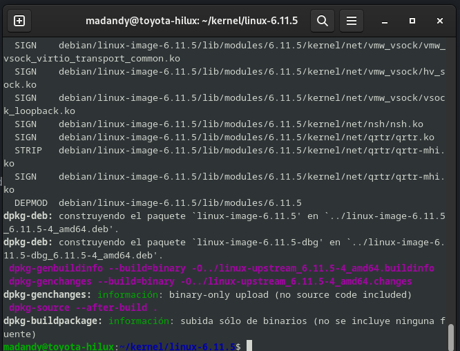

Se recomienda realizar una previa lectura del post Compilación de un programa en C utilizando un Makefile, pues en este artículo se tratarán con menor profundidad u obviarán algunos aspectos vistos con anterioridad.

El kernel del sistema operativo es el componente más interno después del hardware. Es la parte fundamental del sistema operativo y se encarga de manejar los recursos y permitir que los programas hagan uso de los mismos mediante peticiones de las distintas aplicaciones y procesos que se están ejecutando, siendo éstos recursos principalmente:

- CPU.
- Memoria.
- Dispositivos de entrada/salida (I/O).


Es además el encargado de proporcionar protección mediante diferentes niveles de acceso o rings (asegurando que las aplicaciones únicamente accedan donde deben) y acceso compartido multiplexado, es decir, que las aplicaciones crean que tienen a su disposición todos los recursos, pero en realidad estén siendo compartidos y se compita por los mismos.

Lo más habitual hoy en día es que en los kernel existan al menos 2 niveles para acceder tanto a la CPU como a la memoria:

- Kernel Mode: Sin restricciones, es decir, privilegiado. Su ejecución se lleva a cabo de una forma mucho más sencilla, pero con las correspondientes consideraciones en cuanto a seguridad.
U
- User Mode: Restringido, es decir, no privilegiado. Su ejecución no es tan sencilla como el nivel anterior, pero es mucho más segura.


Dependiendo de que algo se ejecute en Kernel Mode o en User Mode, tendrá o no acceso restringido a la CPU, es decir, el acceso a los recursos de la máquina de un proceso que se ejecute en User Mode estará controlado a través del kernel, mientras que si ese mismo proceso se ejecutase en Kernel Mode, no existiría ningún tipo de restricción.

Generalmente, se suelen implementar 4 anillos a nivel de procesador, pero posteriormente los sistemas operativos únicamente suelen usar 2 de ellos: el más interno (Anillo 0) para procesos en Kernel Mode y el más externo (Anillo 4) para procesos en User Mode. En Internet se puede encontrar bastante información al respecto, pues su detallada explicación se saldría del objetivo de esta tarea.

Vamos a dejar de lado la teoría general de los kernel de los sistemas operativos para centrarnos en el kernel Linux. Se trata de un kernel monolítico que incluye una parte muy importante de los componentes como módulos compilados con enlace dinámico, de manera que la parte que se carga en memoria estáticamente es una parte pequeña, pues también está pensado para pequeños dispositivos cuya cantidad de memoria sea mínima, por lo que debemos intentar que sea lo más pequeño posible, dejando para ello en la parte estática los componentes estrictamente esenciales.

Por definición, al tratarse de un kernel monolítico, implica que todos (o casi todos) sus componentes se ejecutan en Kernel Mode, teniendo por tanto la ventaja de que al acceder sin restricciones, es mucho más sencillo operar con el mismo, con su correspondiente mejora en cuanto a rendimiento, al no tener que realizar llamadas entre los elementos del kernel. Dicha característica implicaría vulnerabilidades en un principio, pero al haber sido desarrollados todos los componentes por el mismo proyecto, no existe dicho problema, pues generalmente, no introducimos nada que no haya sido desarrollado por el propio kernel Linux.

Tenemos la posibilidad de descargar el kernel sin compilar desde kernel.org, aunque lo que generalmente se suele hacer es descargar una distribución, que ya contiene un kernel totalmente funcional y trae consigo una paquetería base, de manera que se convierte en algo muy sencillo de usar por parte de los usuarios, al no requerir grandes conocimientos. Actualmente, el código fuente de rama vanilla del kernel ocupa 1.1 GiB.

Anteriormente he hecho uso de los términos estático y dinámico. Ésto se debe a que los componentes del kernel se pueden compilar (enlazar) de dos formas distintas:

- Estáticamente: Todos los componentes forman un único fichero binario que se carga en memoria, denominado vmlinuz o zImage. Compilar todo el kernel de forma estática supondría compilar los 1.1 GiB (o una selección de dichos componentes), quedando un fichero binario de 300, 400, 500 MiB… que se cargaría en memoria. Esto no sería un problema para máquinas de hoy en día, pero para los dispositivos pequeños, sí, pues sus recursos son limitados.

- Dinámicamente: Para solventar el problema que acabamos de mencionar existe la parte dinámica, que se encuentra compuesta por ficheros objeto con extensión .ko (kernel object), y dichos componentes (también conocidos como módulos) se cargan a demanda en memoria (se requiere tener el sistema de ficheros donde están contenidos previamente montado). Ésta es la parte más pesada.
Una vez explicado lo necesario para conocer de manera superficial qué es el kernel, más concretamente el kernel Linux, es hora de compilar nuestro propio kernel. Ésto no es algo que se haga frecuentemente hoy en día (aunque existen excepciones, como los sistemas embebidos o dispositivos empotrados), ya que las distribuciones Linux optan por compilar kernel suficientemente genéricos que soporten la mayor cantidad de situaciones posibles, pero nunca está de más ver la estructura de nuestro sistema de una forma más interna e intentar dejarlo lo más pequeño posible (desintegrando para ello los componentes no necesarios y rechazando el uso de otro tipo de funcionalidades no esenciales), para ver dónde se encuentran los límites, y así aprender a realizar ésta técnica.

El primer paso a llevar a cabo será crear un directorio en el que vamos a trabajar, para así mantener una organización en todo momento. En mi caso, he generado uno de nombre compkernel/, ejecutando para ello el comando:


```
madandy@toyota-hilux:~$ mkdir kernel

```
Ahora accedemos a la carpeta con el siguienet coamndo:

```
madandy@toyota-hilux:~$ cd kernel/
madandy@toyota-hilux:~/kernel$ 


```

Para llevar a cabo la compilación, necesitaremos una determinada paquetería, entre la que se encuentra el compilador de C, make, algunas bibliotecas básicas… ésto tiene fácil solución, y es que en lugar de ir instalándolos uno por uno, instalaremos build-essential, que contiene todo lo necesario. Además, posteriormente utilizaremos una aplicación gráfica que nos hará mas amena la tarea de selección de componentes del kernel, que hace uso de las bibliotecas de qt, por lo que tendremos que instalar también el paquete qtbase5-dev (hay otras aplicaciones que hacen uso de otras bibliotecas como las de gtk o ncurses, pero en este caso, no las usaremos). El comando a ejecutar sería:

```
madandy@toyota-hilux:~/kernel$  sudo apt install build-essential qtbase5-dev
```

Ya está todo listo para descargar el código fuente de nuestro kernel, pero primero tendremos que descubrir cuál estamos usando (en caso que no lo sepamos). Para ello, haremos uso de uname:

```
madandy@toyota-hilux:~/kernel$  uname -r
6.1.0-26-amd64

```

Desglose:

- r: Le pedimos que nos muestre la release en lugar del nombre.

Como se puede apreciar, la versión de núcleo que actualmente estoy utilizando es la 6.1.0-26 Llegados a este punto, tenemos dos posibilidades para obtener el código fuente de nuestro kernel:

```
usuario@maquina1:~/compkernel$ wget https://mirrors.edge.kernel.org/pub/linux/kernel/v6.x/linux-6.1.1.tar.xz 
--2024-10-23 22:44:43--  https://mirrors.edge.kernel.org/pub/linux/kernel/v6.x/linux-6.1.1.tar.xz
Resolviendo mirrors.edge.kernel.org (mirrors.edge.kernel.org)... 2604:1380:4601:e00::3, 147.75.80.249
Conectando con mirrors.edge.kernel.org (mirrors.edge.kernel.org)[2604:1380:4601:e00::3]:443... conectado.
Petición HTTP enviada, esperando respuesta... 200 OK
Longitud: 134730676 (128M) [application/x-xz]
Grabando a: «linux-6.1.1.tar.xz»

linux-6.1.1.tar.xz  100%[===================>] 128,49M  6,34MB/s    en 33s     

2024-10-23 22:45:17 (3,85 MB/s) - «linux-6.1.1.tar.xz» guardado [134730676/134730676]


```

Verificamos con el comando ls -l:

```

madandy@toyota-hilux:~/kernel$  ls -l
total 131576
-rw-r--r-- 1 usuario usuario 134730676 dic 21  2022 linux-6.11.5.tar.xz
usuario@maquina1:~/compkernel$ 

```
Efectivamente, se ha descargado un paquete de nombre “linux-source-6.11.5.tar.xz” c. Sin embargo, nada podemos hacer hasta que no llevamos a cabo la extracción de los ficheros contenidos. Para ello, ejecutaremos el comando:

```
madandy@toyota-hilux:~/kernel$  tar -Jxf linux-6.11.5.tar.xz 

```
Donde:

-J: Utiliza xz para descomprimir el fichero.
-x: Indica a tar que desempaquete el fichero.
-f: Indica a tar que el siguiente argumento es el nombre del fichero .tar.xz.

Para verificar que el fichero se ha descomprimido correctamente, haremos uso del comando:

```
madandy@toyota-hilux:~/kernel$  ls
linux-6.11.5  linux-6.1.1.tar.xz
madandy@toyota-hilux:~/kernel$  

```
Como se puede apreciar, el resultado de la descompresión se encuentra ubicado en un directorio de nombre linux-5.7/, al que accederemos ejecutando el comando:

```
madandy@toyota-hilux:~/kernel$ cd linux-6.11.5/
madandy@toyota-hilux:~/kernel/linux-6.11.5$ 
```
haciendo un ls ahora mismo:


```

usuario@maquina1:~/compkernel/linux-6.11.5$ ls
arch     CREDITS        fs        ipc      lib          mm      samples   tools
block    crypto         include   Kbuild   LICENSES     net     scripts   usr
certs    Documentation  init      Kconfig  MAINTAINERS  README  security  virt
COPYING  drivers        io_uring  kernel   Makefile     rust    sound
usuario@maquina1:~/compkernel/linux-6.11.5.1$ 
```

Efectivamente, todo el contenido se ha descomprimido, tal y como queríamos. Por curiosidad, vamos a comprobar el tamaño del directorio actual y de todos sus ficheros y directorios de forma recursiva, ejecutando para ello el comando:

```
usuario@maquina1:~/compkernel/linux-6.11.5$ du -sh
1,4G	.
usuario@maquina1:~/compkernel/li
```

Donde:

-s: Le indicamos que muestre el tamaño total, es decir, el tamaño recursivo.
-h: Le indicamos que muestre el tamaño en formato humano, en lugar de mostrarlo en bytes.
Como se puede apreciar, el tamaño total tras la descompresión es de 1.1 GiB, tal y como hemos mencionado con anterioridad.

Si nos fijamos en el contenido anteriormente mostrado, existe un fichero Makefile cuyo contenido es bastante complejo, pues contiene todas las instrucciones necesarias para llevar a cabo dicha compilación, pero la ventaja es que se nos proporciona un comando de ayuda para aprender los primeros pasos y las diferentes opciones y parámetros de los que disponemos a la hora de llevar a cabo la compilación. Dicho comando es make help.


Para las compilaciones se hace uso de un fichero de nombre .config que contiene la información sobre qué componentes se van a enlazar estáticamente, cuáles dinámicamente y cuáles no se van a enlazar. Dicho fichero no se encuentra todavía generado, así que para generarlo tomando como punto de partida nuestra configuración actual del núcleo (existente en /boot/, tal y como veremos más adelante), haremos uso del comando make oldconfig, que a pesar de que preguntará explícitamente si queremos incluir determinados componentes opcionales, en mi caso, dije que no a todos ellos, ya que no serán necesarios:

Nos va a dar este erroer:

```
usuario@maquina1:~/compkernel/linux-6.11.5$ make oldconfig
  HOSTCC  scripts/basic/fixdep
  HOSTCC  scripts/kconfig/conf.o
  HOSTCC  scripts/kconfig/confdata.o
  HOSTCC  scripts/kconfig/expr.o
  LEX     scripts/kconfig/lexer.lex.c
/bin/sh: 1: flex: not found
make[1]: *** [scripts/Makefile.host:9: scripts/kconfig/lexer.lex.c] Error 127
make: *** [Makefile:697: oldconfig] Error 2
usuario@maquina1:~/compkernel/linux-6.1.1$ 

```

El cual se arregla ibnstalado:

```
usuario@maquina1:~/compkernel/linux-6.1.1$ sudo apt install flex -y

usuario@maquina1:~/compkernel/linux-6.1.1$ sudo apt install bison

```
y Nos aparece por pantalla lo s iguiente:

```
usuario@maquina1:~/compkernel/linux-6.1.1$ sudo make oldconfig
  YACC    scripts/kconfig/parser.tab.[ch]
  HOSTCC  scripts/kconfig/lexer.lex.o
  HOSTCC  scripts/kconfig/menu.o
  HOSTCC  scripts/kconfig/parser.tab.o
  HOSTCC  scripts/kconfig/preprocess.o
  HOSTCC  scripts/kconfig/symbol.o
  HOSTCC  scripts/kconfig/util.o
  HOSTLD  scripts/kconfig/conf
#
# using defaults found in arch/x86/configs/x86_64_defconfig
#
*
* Restart config...
*
*
* General setup


```

Esto nos dara problemas en la compilación por lo que tendremos que meter el siguiente comando:

```
sudo apt install dwarves
```

Y despues lo que tendremso que hacer es el meter el comando:

```
madandy@toyota-hilux:~/kernel/linux-6.11.5$ make -j20 
```

Para realizar la compilación, y si todo va bien tendremos esto al final:



Si vemos en esta configuración tenemos configurados 2539 modulos de forma estatica, y ninguno dinamicamente:

```
madandy@toyota-hilux:~/kernel/linux-6.11.5$ egrep '=y' .config | wc -l
2539
madandy@toyota-hilux:~/kernel/linux-6.11.5$ egrep '=n' .config | wc -l
0
madandy@toyota-hilux:~/kernel/linux-6.11.5$ 

```

Ahora despues de esto hacemos lo siguiente:

```
madandy@toyota-hilux:~/kernel/linux-6.11.5$ cd ..
madandy@toyota-hilux:~/kernel$ ls
linux-6.11.5
linux-headers-6.11.5_6.11.5-4_amd64.deb
linux-image-6.11.5_6.11.5-4_amd64.deb
linux-image-6.11.5-dbg_6.11.5-4_amd64.deb
linux-libc-dev_6.11.5-4_amd64.deb
linux-upstream_6.11.5-4_amd64.buildinfo
linux-upstream_6.11.5-4_amd64.changes

```

Ahora tenemos que desemaquetar los archivos *.deb*:

```
madandy@toyota-hilux:~/kernel$ sudo dpkg -i linux-headers-6.11.5_6.11.5-4_amd64.deb 
Seleccionando el paquete linux-headers-6.11.5 previamente no seleccionado.
(Leyendo la base de datos ... 268864 ficheros o directorios instalados actualmente.)
Preparando para desempaquetar linux-headers-6.11.5_6.11.5-4_amd64.deb ...
Desempaquetando linux-headers-6.11.5 (6.11.5-4) ...
Configurando linux-headers-6.11.5 (6.11.5-4) ...
madandy@toyota-hilux:~/kernel$ sudo dpkg -i linux-image-6.11.5_6.11.5-4_amd64.deb 
Seleccionando el paquete linux-image-6.11.5 previamente no seleccionado.
(Leyendo la base de datos ... 283087 ficheros o directorios instalados actualmente.)
Preparando para desempaquetar linux-image-6.11.5_6.11.5-4_amd64.deb ...
Desempaquetando linux-image-6.11.5 (6.11.5-4) ...
Configurando linux-image-6.11.5 (6.11.5-4) ...
update-initramfs: Generating /boot/initrd.img-6.11.5
.....
....
...
W: Possible missing firmware /lib/firmware/nvidia/tu104/gsp/gsp-535.113.01.bin for module nouveau
W: Possible missing firmware /lib/firmware/nvidia/tu104/gsp/bootloader-535.113.01.bin for module nouveau
W: Possible missing firmware /lib/firmware/nvidia/tu104/gsp/booter_unload-535.113.01.bin for module nouveau
W: Possible missing firmware /lib/firmware/nvidia/tu104/gsp/booter_load-535.113.01.bin for module nouveau
W: Possible missing firmware /lib/firmware/nvidia/tu102/gsp/gsp-535.113.01.bin for module nouveau
W: Possible missing firmware /lib/firmware/nvidia/tu102/gsp/bootloader-535.113.01.bin for module nouveau
W: Possible missing firmware /lib/firmware/nvidia/tu102/gsp/booter_unload-535.113.01.bin for module nouveau
W: Possible missing firmware /lib/firmware/nvidia/tu102/gsp/booter_load-535.113.01.bin for module nouveau
W: Possible missing firmware /lib/firmware/nvidia/ga107/sec2/hs_bl_sig.bin for module nouveau
W: Possible missing firmware /lib/firmware/nvidia/ga107/sec2/sig.bin for module nouveau
W: Possible missing firmware /lib/firmware/nvidia/ga107/sec2/image.bin for module nouveau
W: Possible missing firmware /lib/firmware/nvidia/ga107/sec2/desc.bin for module nouveau
W: Possible missing firmware /lib/firmware/nvidia/ga106/sec2/hs_bl_sig.bin for module nouveau
W: Possible missing firmware /lib/firmware/nvidia/ga106/sec2/sig.bin for module nouveau
W: Possible missing firmware /lib/firmware/nvidia/ga106/sec2/image.bin for module nouveau
W: Possible missing firmware /lib/firmware/nvidia/ga106/sec2/desc.bin for module nouveau
W: Possible missing firmware /lib/firmware/nvidia/ga104/sec2/hs_bl_sig.bin for module nouveau
W: Possible missing firmware /lib/firmware/nvidia/ga104/sec2/sig.bin for module nouveau
W: Possible missing firmware /lib/firmware/nvidia/ga104/sec2/image.bin for module nouveau
W: Possible missing firmware /lib/firmware/nvidia/ga104/sec2/desc.bin for module nouveau
W: Possible missing firmware /lib/firmware/nvidia/ga103/sec2/hs_bl_sig.bin for module nouveau
W: Possible missing firmware /lib/firmware/nvidia/ga103/sec2/sig.bin for module nouveau
W: Possible missing firmware /lib/firmware/nvidia/ga103/sec2/image.bin for module nouveau
W: Possible missing firmware /lib/firmware/nvidia/ga103/sec2/desc.bin for module nouveau
Generating grub configuration file ...
Found background image: /usr/share/images/desktop-base/desktop-grub.png
Found linux image: /boot/vmlinuz-6.11.5
Found initrd image: /boot/initrd.img-6.11.5
Found linux image: /boot/vmlinuz-6.1.0-26-amd64
Found initrd image: /boot/initrd.img-6.1.0-26-amd64
Found linux image: /boot/vmlinuz-6.1.0-25-amd64
Found initrd image: /boot/initrd.img-6.1.0-25-amd64
Warning: os-prober will be executed to detect other bootable partitions.
Its output will be used to detect bootable binaries on them and create new boot entries.
Found Windows Boot Manager on /dev/nvme0n1p1@/EFI/Microsoft/Boot/bootmgfw.efi
Adding boot menu entry for UEFI Firmware Settings ...
done
madandy@toyota-hilux:~/kernel$ sudo dpkg -i linux-image-6.11.5-dbg_6.11.5-4_amd64.deb 
Seleccionando el paquete linux-image-6.11.5-dbg previamente no seleccionado.
(Leyendo la base de datos ... 288006 ficheros o directorios instalados actualmente.)
Preparando para desempaquetar linux-image-6.11.5-dbg_6.11.5-4_amd64.deb ...
Desempaquetando linux-image-6.11.5-dbg (6.11.5-4) ...
Configurando linux-image-6.11.5-dbg (6.11.5-4) ...
madandy@toyota-hilux:~/kernel$ ls
linux-6.11.5
linux-headers-6.11.5_6.11.5-4_amd64.deb
linux-image-6.11.5_6.11.5-4_amd64.deb
linux-image-6.11.5-dbg_6.11.5-4_amd64.deb
linux-libc-dev_6.11.5-4_amd64.deb
linux-upstream_6.11.5-4_amd64.buildinfo
linux-upstream_6.11.5-4_amd64.changes
madandy@toyota-hilux:~/kernel$ sudo dpkg -i linux-libc-dev_6.11.5-4_amd64.deb 
(Leyendo la base de datos ... 292917 ficheros o directorios instalados actualmente.)
Preparando para desempaquetar linux-libc-dev_6.11.5-4_amd64.deb ...
Desempaquetando linux-libc-dev:amd64 (6.11.5-4) sobre (6.1.112-1) ...
Configurando linux-libc-dev:amd64 (6.11.5-4) ...
madandy@toyota-hilux:~/kernel$ 

```

Ya una vez todo instalado nos vamos a asegurar que el kernel se ha instalado:

```
madandy@toyota-hilux:~/kernel$ ls -l /boot/ | grep 6.11.5
-rw-r--r-- 1 root root   275246 oct 24 16:29 config-6.11.5
-rw-r--r-- 1 root root 70904934 oct 24 17:10 initrd.img-6.11.5
-rw-r--r-- 1 root root  6433572 oct 24 16:29 System.map-6.11.5
-rw-r--r-- 1 root root  9593344 oct 24 16:29 vmlinuz-6.11.5
madandy@toyota-hilux:~/kernel$ 

```

Ahora lo qu etebndremos que hacer es iniciar y ver si lo ha instalado , y efectivamente lo tenemos instalado:

```
madandy@toyota-hilux:~$ uname -r
6.11.5
madandy@toyota-hilux:~$ 

```