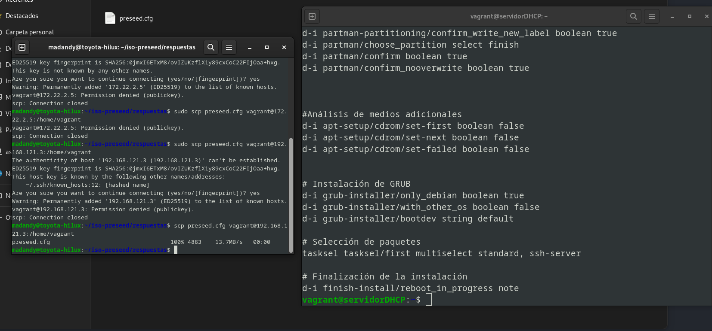
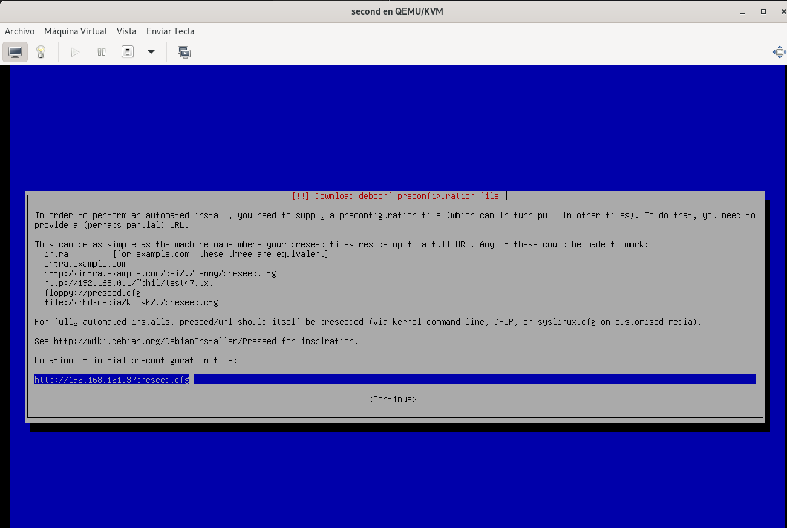
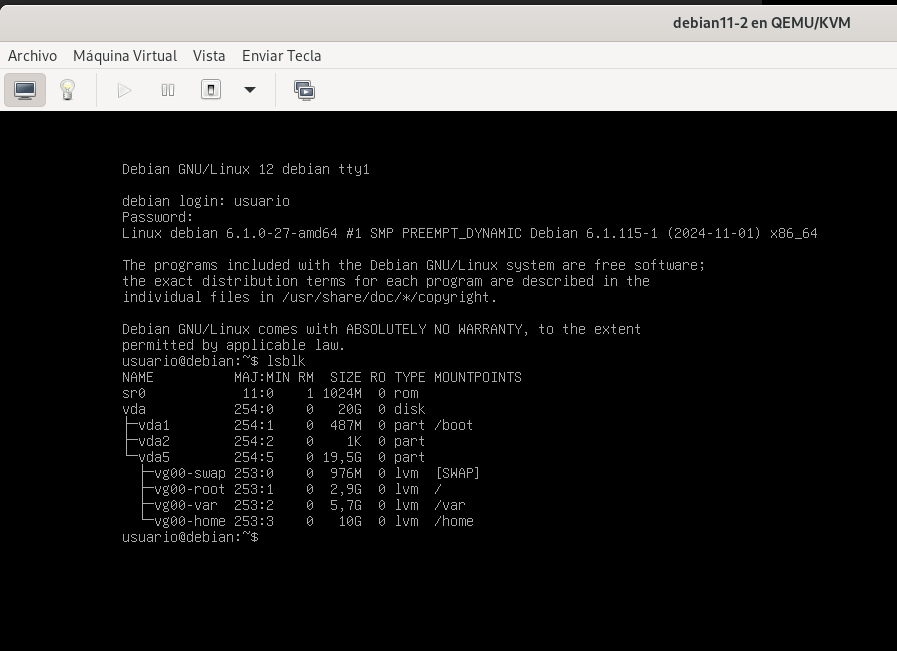
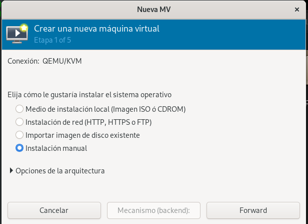
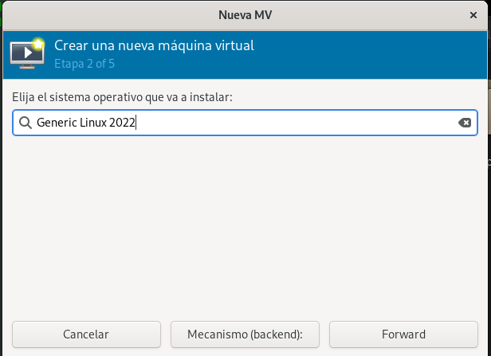
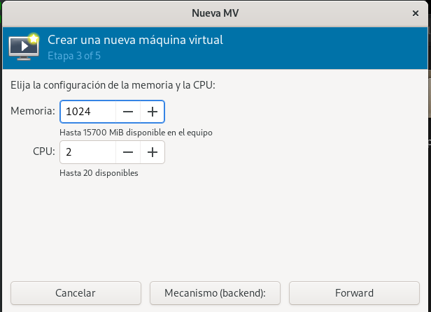
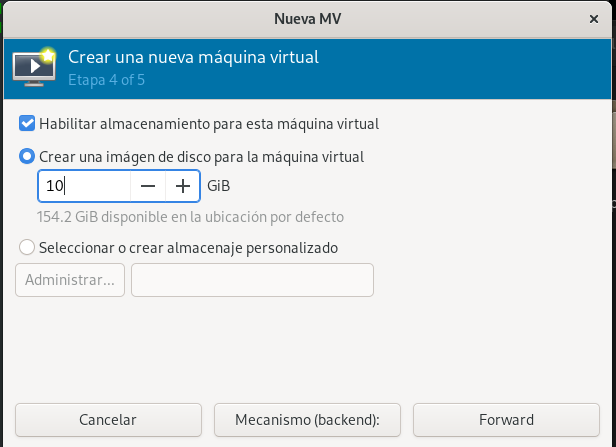
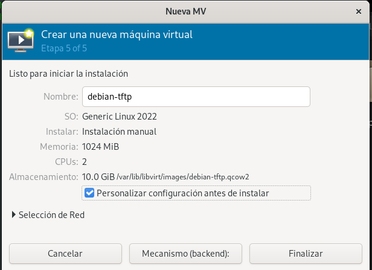
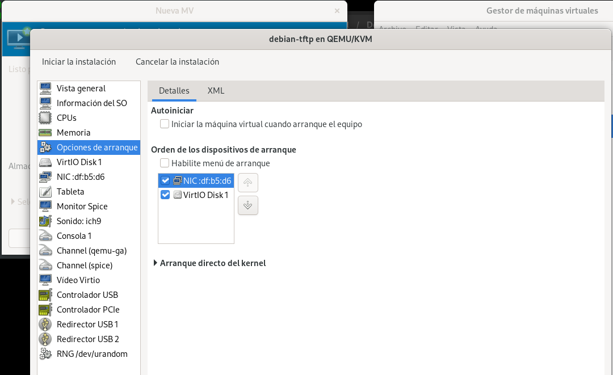
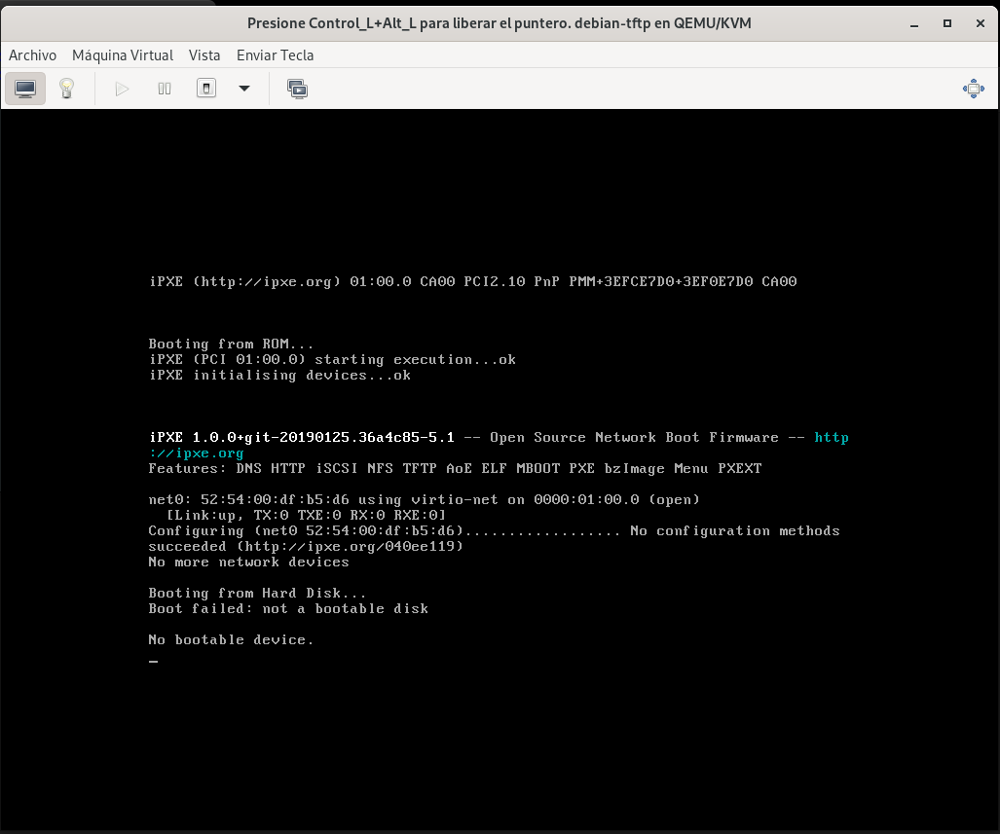

# Instalación basada en fichero de conifiguración preseed


## Introducción 

Creación de un sistema automatizado de instalación. Se deberá configurar el sistema para que se responda automáticamente a todos los item en la instalación. Las diferentes contraseñas deberán codificarse para que no aparezcan en texto plano. Se trabajará con un esquema lvm creando volúmenes lógicos /, home y var.

1. Instalación basada en fichero de configuración preseed.
- Instalación automatizada basada en medio de almacenamiento extraíble.
- Instalación automatizada con carga de preseed desde red.
2. Instalación basada en preseed/PXE/TFTP.

## Pasos

Para realizar esta práctica, el primer paso que debemos hacer será descargarnos la imagen ISO con la que vamos a trabajar. La que yo he utilizado la podemos encontrar en  [mamela](https://www.debian.org/download)


Una vez que nos hemos descargado la imagen iso, lo montamos en un directorio para poder realizar los cambios convenientes y lo haremos de la siguiente manera:

```
madandy@toyota-hilux:~$ sudo mkdir -p /mnt/iso

madandy@toyota-hilux:/mnt/iso$ sudo mount -o loop debian-12.8.0-amd64-netinst.iso /mnt/iso/
mount: /mnt/iso: ATENCIÓN: origen protegido contra escritura; se monta como solo lectura.
```
Para montar la iso desatendida, no vamos a necesitar todos los ficheros, sino que vamos a copiar los necesarios y crearemos un enlace simbólico que apuntará al resto.

```
madandy@toyota-hilux:~$ mkdir iso-preseed && cd iso-preseed      
madandy@toyota-hilux:~/iso-preseed$ cp -pr /mnt/iso/install.amd install.amd
madandy@toyota-hilux:~/iso-preseed$ cp -pr /mnt/iso/dists dists
madandy@toyota-hilux:~/iso-preseed$ cp -pr /mnt/iso/pool pool
madandy@toyota-hilux:~/iso-preseed$ cp -pr /mnt/iso/.disk .disk
madandy@toyota-hilux:~/iso-preseed$ cp -pr /mnt/iso/isolinux isolinux
madandy@toyota-hilux:~/iso-preseed$ ln -s . debian
```

Dentro de este directorio, creamos el directorio donde vamos a alojar nuesstro archivo preseed.cfg. En mi caso, tiene la siguiente estructura:
Lo primero que he hecho ha sido crear un direectorio llamado *calamardo*, y dentro hacer el fichero:

```
madandy@toyota-hilux:~/iso-preseed/calamardo$ ls
preseed.cfg
```

```
##############################################################################
#   Instalación automatizada de Debian con particiones LVM usando todo el disco
##############################################################################

# Configuración de idioma y localización
d-i debian-installer/locale string es_ES
d-i debian-installer/language string spanish
d-i debian-installer/country string Spain
d-i debian-installer/locale string es_ES.UTF-8
d-i localechooser/supported-locales es_ES.UTF-8

# Configuración del teclado
d-i keyboard-configuration/toggle select No toggling
d-i keymap select es
d-i console-setup/ask_detect boolean true
d-i keyboard-configuration/modelcode string pc105
d-i keyboard-configuration/layoutcode string es
d-i keyboard-configuration/variantcode string qwerty

# Configuración de red
d-i netcfg/choose_interface select auto

# Creación del usuario y superusuario
d-i passwd/root-password-crypted password $6$kzdzYBwYdWnnkRNc$8CFoTaa6NAfeTwM4G1hBn9Tg2gIKQC1PEBUlTtrHi59zsLmSMNZYRUCeltCki5WicMGZnDDfSshsd5BLrMaTL/

d-i passwd/root-password-again-crypted password $6$kzdzYBwYdWnnkRNc$8CFoTaa6NAfeTwM4G1hBn9Tg2gIKQC1PEBUlTtrHi59zsLmSMNZYRUCeltCki5WicMGZnDDfSshsd5BLrMaTL/


# Creación del usuario normal
d-i passwd/user-fullname string usuario
d-i passwd/username string usuario
d-i passwd/user-password-crypted password $6$kzdzYBwYdWnnkRNc$8CFoTaa6NAfeTwM4G1hBn9Tg2gIKQC1PEBUlTtrHi59zsLmSMNZYRUCeltCki5WicMGZnDDfSshsd5BLrMaTL/


# Configuración del nombre de host y dominio
d-i netcfg/get_hostname string debian
d-i netcfg/get_domain string
d-i hw-detect/load_firmware boolean false

# Configuración de zona horaria
d-i clock-setup/utc boolean true
d-i time/zone string ES/Madrid
d-i clock-setup/ntp boolean true

# Configuración de los repositorios Debian
d-i mirror/country string manual
d-i mirror/http/hostname string ftp.es.debian.org
d-i mirror/http/directory string /debian
d-i mirror/http/proxy string

# Desactivar la participación en la encuesta
popularity-contest popularity-contest/participate boolean false

# Configuración de particiones

# Usar todo el espacio disponible en LVM sin preguntar al usuario
d-i partman-auto/method string lvm
d-i partman-lvm/device_remove_lvm boolean true  # Eliminar LVM si ya está presente
d-i partman-lvm/confirm boolean true
d-i partman-lvm/confirm_nooverwrite boolean true

# Configuración de particionamiento
d-i partman-auto/disk string /dev/vda
d-i partman-lvm/device_remove_lvm boolean true
d-i partman-auto/method string lvm
d-i partman-lvm/confirm boolean true
d-i partman-auto/choose_recipe select mypartitioning
d-i partman-auto-lvm/new_vg_name string vg00
d-i partman-auto-lvm/guided_size string max
d-i partman-lvm/confirm_nooverwrite boolean true

# Esquema de particionamiento personalizado
d-i partman-auto/expert_recipe string \
      mypartitioning :: \
              512 1 512 xfs \
                      $primary{ } $bootable{ } \
                      method{ format } format{ } \
                      use_filesystem{ } filesystem{ xfs } \
                      mountpoint{ /boot } \
              . \
              1024 1 1024 linux-swap \
                      $defaultignore{ } \
                      $lvmok{ } \
                      lv_name{ swap } \
                      in_vg { vg00 } \
                      method{ swap } format{ } \
              . \
              3072 1 3072 xfs \
                      $defaultignore{ } \
                      $lvmok{ } \
                      lv_name{ root } \
                      in_vg { vg00 } \
                      method{ format } format{ } \
                      use_filesystem{ } filesystem{ xfs } \
                      mountpoint{ / } \
              . \
              6144 1 6144 xfs \
                      $defaultignore{ } \
                      $lvmok{ } \
                      lv_name{ var } \
                      in_vg { vg00 } \
                      method{ format } format{ } \
                      use_filesystem{ } filesystem{ xfs } \
                      mountpoint{ /var } \
              . \
              8192 1 1000000000 xfs \
                      $defaultignore{ } \
                      $lvmok{ } \
                      lv_name{ home } \
                      in_vg { vg00 } \
                      method{ format } format{ } \
                      use_filesystem{ } filesystem{ xfs } \
                      mountpoint{ /home } \
              .

# Confirmación de escritura de nueva etiqueta de partición
d-i partman-partitioning/confirm_write_new_label boolean true
d-i partman/choose_partition select finish
d-i partman/confirm boolean true
d-i partman/confirm_nooverwrite boolean true


#Análisis de medios adicionales
d-i apt-setup/cdrom/set-first boolean false
d-i apt-setup/cdrom/set-next boolean false
d-i apt-setup/cdrom/set-failed boolean false


# Instalación de GRUB
d-i grub-installer/only_debian boolean true
d-i grub-installer/with_other_os boolean false
d-i grub-installer/bootdev string default

# Selección de paquetes
tasksel tasksel/first multiselect standard, ssh-server

# Finalización de la instalación
d-i finish-install/reboot_in_progress note

```
Cabe señalar que habrá que codificar las contraseñas, por lo que tendremos que meter por consola lo siguiente:

```
madandy@toyota-hilux:~$ mkpasswd --method=SHA-512 usuario
$6$kzdzYBwYdWnnkRNc$8CFoTaa6NAfeTwM4G1hBn9Tg2gIKQC1PEBUlTtrHi59zsLmSMNZYRUCeltCki5WicMGZnDDfSshsd5BLrMaTL/

```
El siguiente paso que realizaremos será el de editar el archivo txt.cfg ubicado dentro del directorio /isolinux de la siguiente forma:

```
default install
label install
        menu label ^Install
        kernel /install.amd/vmlinuz
        append vga=788 initrd=/install.amd/initrd.gz -- quiet
label unattended-gnome
 menu label ^Instalacion desatendida Debian 11
 kernel /install.amd/gtk/vmlinuz
 append vga=788 initrd=/install.amd/gtk/initrd.gz preseed/file=/cdrom/respuestas/preseed.cfg locale=es_ES console-setup/ask_detect=false keyboard-configuration/xkb-keymap=es --

```
Al realizar cambios en el directorio /isolinux, generaremos la suma de verificación que irá alojada en el CD:


```
madandy@toyota-hilux:~/iso-preseed$ md5sum `find ! -name "md5sum.txt" ! -path "./isolinux/*" -follow -type f` > md5sum.txt
find: ‘./.debian’: Demasiados niveles de enlaces simbólicos
find: Se ha detectado un bucle en el sistema de ficheros; ‘./debian’ es parte del mismo bucle de sistema de ficheros que ‘.’.
madandy@toyota-hilux:~/iso-preseed$ 

```

Ahora nos iremos fuera del directorio y hacemos lo siguiente:

```
madandy@toyota-hilux:~$ sudo genisoimage -o cd-preseed.iso -l -r -J -no-emul-boot -boot-load-size 4 -boot-info-table -b isolinux/isolinux.bin -c isolinux/boot.cat iso-preseed
I: -input-charset not specified, using utf-8 (detected in locale settings)
Size of boot image is 4 sectors -> No emulation
  1.56% done, estimate finish Thu Nov 21 16:48:05 2024
  3.12% done, estimate finish Thu Nov 21 16:48:05 2024
  4.68% done, estimate finish Thu Nov 21 16:48:05 2024
  6.24% done, estimate finish Thu Nov 21 16:48:05 2024
  7.80% done, estimate finish Thu Nov 21 16:48:05 2024
  9.36% done, estimate finish Thu Nov 21 16:48:05 2024
 10.92% done, estimate finish Thu Nov 21 16:48:05 2024
 12.48% done, estimate finish Thu Nov 21 16:48:05 2024
 14.04% done, estimate finish Thu Nov 21 16:48:05 2024
 15.60% done, estimate finish Thu Nov 21 16:48:05 2024
 17.16% done, estimate finish Thu Nov 21 16:48:05 2024
 18.72% done, estimate finish Thu Nov 21 16:48:05 2024
 20.28% done, estimate finish Thu Nov 21 16:48:05 2024
 21.84% done, estimate finish Thu Nov 21 16:48:05 2024
 23.40% done, estimate finish Thu Nov 21 16:48:05 2024
 24.96% done, estimate finish Thu Nov 21 16:48:05 2024
 26.52% done, estimate finish Thu Nov 21 16:48:05 2024
 28.08% done, estimate finish Thu Nov 21 16:48:05 2024
 29.64% done, estimate finish Thu Nov 21 16:48:08 2024
 31.20% done, estimate finish Thu Nov 21 16:48:08 2024
 32.76% done, estimate finish Thu Nov 21 16:48:08 2024
 34.33% done, estimate finish Thu Nov 21 16:48:07 2024
 35.89% done, estimate finish Thu Nov 21 16:48:07 2024
 37.44% done, estimate finish Thu Nov 21 16:48:07 2024
 39.01% done, estimate finish Thu Nov 21 16:48:07 2024
 40.56% done, estimate finish Thu Nov 21 16:48:07 2024
 42.12% done, estimate finish Thu Nov 21 16:48:07 2024
 43.68% done, estimate finish Thu Nov 21 16:48:07 2024
 45.24% done, estimate finish Thu Nov 21 16:48:07 2024
 46.81% done, estimate finish Thu Nov 21 16:48:07 2024
 48.36% done, estimate finish Thu Nov 21 16:48:07 2024
 49.92% done, estimate finish Thu Nov 21 16:48:07 2024
 51.48% done, estimate finish Thu Nov 21 16:48:06 2024
 53.04% done, estimate finish Thu Nov 21 16:48:06 2024
 54.60% done, estimate finish Thu Nov 21 16:48:06 2024
 56.17% done, estimate finish Thu Nov 21 16:48:06 2024
 57.72% done, estimate finish Thu Nov 21 16:48:06 2024
 59.29% done, estimate finish Thu Nov 21 16:48:06 2024
 60.84% done, estimate finish Thu Nov 21 16:48:06 2024
 62.41% done, estimate finish Thu Nov 21 16:48:06 2024
 63.96% done, estimate finish Thu Nov 21 16:48:06 2024
 65.53% done, estimate finish Thu Nov 21 16:48:06 2024
 67.08% done, estimate finish Thu Nov 21 16:48:06 2024
 68.64% done, estimate finish Thu Nov 21 16:48:06 2024
 70.21% done, estimate finish Thu Nov 21 16:48:06 2024
 71.77% done, estimate finish Thu Nov 21 16:48:06 2024
 73.32% done, estimate finish Thu Nov 21 16:48:06 2024
 74.88% done, estimate finish Thu Nov 21 16:48:06 2024
 76.45% done, estimate finish Thu Nov 21 16:48:06 2024
 78.01% done, estimate finish Thu Nov 21 16:48:06 2024
 79.57% done, estimate finish Thu Nov 21 16:48:06 2024
 81.12% done, estimate finish Thu Nov 21 16:48:06 2024
 82.69% done, estimate finish Thu Nov 21 16:48:06 2024
 84.25% done, estimate finish Thu Nov 21 16:48:06 2024
 85.81% done, estimate finish Thu Nov 21 16:48:06 2024
 87.37% done, estimate finish Thu Nov 21 16:48:06 2024
 88.93% done, estimate finish Thu Nov 21 16:48:06 2024
 90.49% done, estimate finish Thu Nov 21 16:48:06 2024
 92.05% done, estimate finish Thu Nov 21 16:48:06 2024
 93.61% done, estimate finish Thu Nov 21 16:48:06 2024
 95.17% done, estimate finish Thu Nov 21 16:48:06 2024
 96.72% done, estimate finish Thu Nov 21 16:48:06 2024
 98.28% done, estimate finish Thu Nov 21 16:48:06 2024
 99.85% done, estimate finish Thu Nov 21 16:48:06 2024
Total translation table size: 2048
Total rockridge attributes bytes: 199882
Total directory bytes: 1085440
Path table size(bytes): 8618
Max brk space used 1d2000
320499 extents written (625 MB)

```
Y ahora lo que tenemos que hacer es coger y pegarlo en mi caso a mi carpeta donde tengo las iso:


Y como podemos comprobar una vez arrancado nos sale lo siguiente:


Pero nos saldra este error, ya que hemos cometido el siguiente fallo:


Por lo que haremos lo siguiente:

```
madandy@toyota-hilux:~/iso-preseed$ mkdir -p /home/madandy/iso-preseed/respuestas
madandy@toyota-hilux:~/iso-preseed$ ls
calamardo  debian  dists  install.amd  isolinux  md5sum.txt  pool  respuestas
madandy@toyota-hilux:~/iso-preseed$ cp /home/madandy/iso-preseed/calamardo/preseed.cfg /home/madandy/iso-preseed/respuestas/
```

Y una vez hecho esto ya podemos arranacarlo y lo tendriamos automatizado y hacemos un lsblk, veriamos lo siguiente;¡:


# Instalacion de forma automatizada con carga de preseed desde red

Para esta ocasión vamos a crear una máquina irtual con vagrabnt en la que configuraremos un servidor *ngninx* y añadiremos nuestra iso (la cual hicimos con anterioridad) a lo que sera nuestro servidor.

```
Vagrant.configure("2") do |config|
  config.vm.box = "debian/bullseye64" 
  config.vm.hostname = "servidorDHCP"
  
  # Configuración de red privada
  config.vm.network :private_network, 
    libvirt__network_name: "red-server",   # Nombre de la red en libvirt
    libvirt__dhcp_enabled: false,         # Deshabilitar DHCP
    ip: "172.22.2.5",                     # IP asignada estáticamente
    libvirt__forward_mode: "none"         # Sin reenvío de tráfico
  
  # Configuraciones adicionales pueden ir aquí
end

```

Ahora configuraremos en esta máquina un servidor *ngnix* donde meteremos el fichero de configuración que llamamos *preseed.cfg*, para ello primero que haremos sera pasarnolos por scp:



Ahora nos dirigiremos a la siguiente dirección:

```
http://192.168.121.3/preseed.cfg
```
Y hacemos un amáquina virtual en la que vamos a aplicar esta configuración a través del método de carga desde la red.

Cuando elegimos la iso virgen, lo que tenemos que ir es a la tercera elección, que e


y como podemos ver, tenemos lo siguiente por pantalla tiotalmente automatizado:



# Instalación basada en preseed/PXE/TFTP

Lo primero que haremos sera usar la máquina anterior y la convertiremos en un servidor DHCP:

```
vagrant@servidorDHCP:~$ sudo apt install isc-dhcp-server -y

```
Y lo vamos a configurar de esta manera:

```
/etc/dhcp/dhcpd.conf

# Define la red y el rango de IPs a asignar
subnet 192.168.121.0 netmask 255.255.255.0 {
    range 192.168.121.20 192.168.121.50;
    option routers 192.168.121.1;
    option domain-name-servers 8.8.8.8, 8.8.4.4;
    option domain-name "example.com";
}

```
en el siguiente fichero pondre la interfaz:

```
vagrant@servidorDHCP:~$ cat  /etc/default/isc-dhcp-server
# Defaults for isc-dhcp-server (sourced by /etc/init.d/isc-dhcp-server)

# Path to dhcpd's config file (default: /etc/dhcp/dhcpd.conf).
#DHCPDv4_CONF=/etc/dhcp/dhcpd.conf
#DHCPDv6_CONF=/etc/dhcp/dhcpd6.conf

# Path to dhcpd's PID file (default: /var/run/dhcpd.pid).
#DHCPDv4_PID=/var/run/dhcpd.pid
#DHCPDv6_PID=/var/run/dhcpd6.pid

# Additional options to start dhcpd with.
#	Don't use options -cf or -pf here; use DHCPD_CONF/ DHCPD_PID instead
#OPTIONS=""

# On what interfaces should the DHCP server (dhcpd) serve DHCP requests?
#	Separate multiple interfaces with spaces, e.g. "eth0 eth1".
INTERFACESv4="eth0"
INTERFACESv6=""

```
Y reinciamos el servicio y vemos su estado:

```
vagrant@servidorDHCP:~$ sudo systemctl restart isc-dhcp-server

vagrant@servidorDHCP:~$ sudo systemctl status isc-dhcp-server
● isc-dhcp-server.service - LSB: DHCP server
     Loaded: loaded (/etc/init.d/isc-dhcp-server; generated)
     Active: active (running) since Sun 2024-11-24 15:17:54 UTC; 5s ago
       Docs: man:systemd-sysv-generator(8)
    Process: 1925 ExecStart=/etc/init.d/isc-dhcp-server start (code=exited, status=0/SUCCESS)
      Tasks: 4 (limit: 510)
     Memory: 4.4M
        CPU: 16ms
     CGroup: /system.slice/isc-dhcp-server.service
             └─1940 /usr/sbin/dhcpd -4 -q -cf /etc/dhcp/dhcpd.conf eth0

Nov 24 15:17:52 servidorDHCP systemd[1]: Starting LSB: DHCP server...
Nov 24 15:17:52 servidorDHCP isc-dhcp-server[1925]: Launching IPv4 server only.
Nov 24 15:17:52 servidorDHCP dhcpd[1940]: Wrote 0 leases to leases file.
Nov 24 15:17:52 servidorDHCP dhcpd[1940]: Server starting service.
Nov 24 15:17:54 servidorDHCP isc-dhcp-server[1925]: Starting ISC DHCPv4 server: dhcpd.
Nov 24 15:17:54 servidorDHCP systemd[1]: Started LSB: DHCP server.

```

Ahora instalremos el servidor TFTP:

```
vagrant@servidorDHCP:~$ sudo apt install tftpd-hpa -y
Reading package lists... Done
Building dependency tree... Done
Reading state information... Done
Suggested packages:
  pxelinux
The following NEW packages will be installed:
  tftpd-hpa
0 upgraded, 1 newly installed, 0 to remove and 29 not upgraded.
Need to get 49.0 kB of archives.
After this operation, 119 kB of additional disk space will be used.
Get:1 https://deb.debian.org/debian bullseye/main amd64 tftpd-hpa amd64 5.2+20150808-1.2 [49.0 kB]
Fetched 49.0 kB in 0s (132 kB/s)
Preconfiguring packages ...
Selecting previously unselected package tftpd-hpa.
(Reading database ... 26177 files and directories currently installed.)
Preparing to unpack .../tftpd-hpa_5.2+20150808-1.2_amd64.deb ...
Unpacking tftpd-hpa (5.2+20150808-1.2) ...
Setting up tftpd-hpa (5.2+20150808-1.2) ...
Processing triggers for man-db (2.9.4-2) ...
vagrant@servidorDHCP:~$ 


```

Ahora crearemos el siguiiente directorio en el que descargaremos la iso para despues decomprimirlo en el mismo:

```
mkdir /srv/tftp #Creamos directorio

cd /srv/tftp #Nos movemos al directorio

wget https://deb.debian.org/debian/dists/bullseye/main/installer-amd64/current/images/netboot/netboot.tar.gz #Nos descargamos la ISO

sudo tar -xvf netboot.tar.gz #Descomprimimos la ISO
```

Aqui dejo desglosado todo lo anterior:

```
vagrant@servidorDHCP:~$ cd /srv/tftp/
vagrant@servidorDHCP:/srv/tftp$ ls
vagrant@servidorDHCP:/srv/tftp$ wget https://deb.debian.org/debian/dists/bullseye/main/installer-amd64/current/images/netboot/netboot.tar.gz #Nos descargamos la ISO
--2024-11-24 15:23:26--  https://deb.debian.org/debian/dists/bullseye/main/installer-amd64/current/images/netboot/netboot.tar.gz
Resolving deb.debian.org (deb.debian.org)... 151.101.134.132, 2a04:4e42:1f::644
Connecting to deb.debian.org (deb.debian.org)|151.101.134.132|:443... connected.
HTTP request sent, awaiting response... 200 OK
Length: 40460103 (39M) [application/x-gzip]
netboot.tar.gz: Permission denied

Cannot write to ‘netboot.tar.gz’ (Permission denied).
vagrant@servidorDHCP:/srv/tftp$ sudo wget https://deb.debian.org/debian/dists/bullseye/main/installer-amd64/current/images/netboot/netboot.tar.gz
--2024-11-24 15:23:39--  https://deb.debian.org/debian/dists/bullseye/main/installer-amd64/current/images/netboot/netboot.tar.gz
Resolving deb.debian.org (deb.debian.org)... 151.101.134.132, 2a04:4e42:1f::644
Connecting to deb.debian.org (deb.debian.org)|151.101.134.132|:443... connected.
HTTP request sent, awaiting response... 200 OK
Length: 40460103 (39M) [application/x-gzip]
Saving to: ‘netboot.tar.gz’

netboot.tar.gz                             100%[=======================================================================================>]  38.58M  6.64MB/s    in 5.9s    

2024-11-24 15:23:45 (6.49 MB/s) - ‘netboot.tar.gz’ saved [40460103/40460103]

vagrant@servidorDHCP:/srv/tftp$ sudo tar -xv
-xvB  -xvF  -xvH  -xvJ  -xvL  -xvN  -xvP  -xvS  -xvU  -xvW  -xvZ  -xvb  -xvg  -xvi  -xvk  -xvm  -xvo  -xvs  -xvz  
-xvC  -xvG  -xvI  -xvK  -xvM  -xvO  -xvR  -xvT  -xvV  -xvX  -xva  -xvf  -xvh  -xvj  -xvl  -xvn  -xvp  -xvw  
vagrant@servidorDHCP:/srv/tftp$ sudo tar -xvf netboot.tar.gz 
./
./debian-installer/
./debian-installer/amd64/
./debian-installer/amd64/boot-screens/
./debian-installer/amd64/boot-screens/addrk.cfg
./debian-installer/amd64/boot-screens/adtxt.cfg
./debian-installer/amd64/boot-screens/drk.cfg
./debian-installer/amd64/boot-screens/drkmenu.cfg
./debian-installer/amd64/boot-screens/exithelp.cfg
./debian-installer/amd64/boot-screens/f1.txt
./debian-installer/amd64/boot-screens/f10.txt
./debian-installer/amd64/boot-screens/f2.txt
./debian-installer/amd64/boot-screens/f3.txt
./debian-installer/amd64/boot-screens/f4.txt
./debian-installer/amd64/boot-screens/f5.txt
./debian-installer/amd64/boot-screens/f6.txt
./debian-installer/amd64/boot-screens/f7.txt
./debian-installer/amd64/boot-screens/f8.txt
./debian-installer/amd64/boot-screens/f9.txt
./debian-installer/amd64/boot-screens/ldlinux.c32
./debian-installer/amd64/boot-screens/libcom32.c32
./debian-installer/amd64/boot-screens/libutil.c32
./debian-installer/amd64/boot-screens/menu.cfg
./debian-installer/amd64/boot-screens/prompt.cfg
./debian-installer/amd64/boot-screens/rqdrk.cfg
./debian-installer/amd64/boot-screens/rqtxt.cfg
./debian-installer/amd64/boot-screens/splash.png
./debian-installer/amd64/boot-screens/stdmenu.cfg
./debian-installer/amd64/boot-screens/syslinux.cfg
./debian-installer/amd64/boot-screens/txt.cfg
./debian-installer/amd64/boot-screens/vesamenu.c32
./debian-installer/amd64/bootnetx64.efi
./debian-installer/amd64/grub/
./debian-installer/amd64/grub/font.pf2
./debian-installer/amd64/grub/grub.cfg
./debian-installer/amd64/grub/x86_64-efi/
./debian-installer/amd64/grub/x86_64-efi/acpi.mod
./debian-installer/amd64/grub/x86_64-efi/adler32.mod
./debian-installer/amd64/grub/x86_64-efi/afsplitter.mod
./debian-installer/amd64/grub/x86_64-efi/ahci.mod
./debian-installer/amd64/grub/x86_64-efi/all_video.mod
./debian-installer/amd64/grub/x86_64-efi/aout.mod
./debian-installer/amd64/grub/x86_64-efi/appleldr.mod
./debian-installer/amd64/grub/x86_64-efi/archelp.mod
./debian-installer/amd64/grub/x86_64-efi/at_keyboard.mod
./debian-installer/amd64/grub/x86_64-efi/ata.mod
./debian-installer/amd64/grub/x86_64-efi/backtrace.mod
./debian-installer/amd64/grub/x86_64-efi/bfs.mod
./debian-installer/amd64/grub/x86_64-efi/bitmap.mod
./debian-installer/amd64/grub/x86_64-efi/bitmap_scale.mod
./debian-installer/amd64/grub/x86_64-efi/blocklist.mod
./debian-installer/amd64/grub/x86_64-efi/boot.mod
./debian-installer/amd64/grub/x86_64-efi/bsd.mod
./debian-installer/amd64/grub/x86_64-efi/bswap_test.mod
./debian-installer/amd64/grub/x86_64-efi/btrfs.mod
./debian-installer/amd64/grub/x86_64-efi/bufio.mod
./debian-installer/amd64/grub/x86_64-efi/cat.mod
./debian-installer/amd64/grub/x86_64-efi/cbfs.mod
./debian-installer/amd64/grub/x86_64-efi/cbls.mod
./debian-installer/amd64/grub/x86_64-efi/cbmemc.mod
./debian-installer/amd64/grub/x86_64-efi/cbtable.mod
./debian-installer/amd64/grub/x86_64-efi/cbtime.mod
./debian-installer/amd64/grub/x86_64-efi/chain.mod
./debian-installer/amd64/grub/x86_64-efi/cmdline_cat_test.mod
./debian-installer/amd64/grub/x86_64-efi/cmp.mod
./debian-installer/amd64/grub/x86_64-efi/cmp_test.mod
./debian-installer/amd64/grub/x86_64-efi/command.lst
./debian-installer/amd64/grub/x86_64-efi/cpio.mod
./debian-installer/amd64/grub/x86_64-efi/cpio_be.mod
./debian-installer/amd64/grub/x86_64-efi/cpuid.mod
./debian-installer/amd64/grub/x86_64-efi/crc64.mod
./debian-installer/amd64/grub/x86_64-efi/crypto.lst
./debian-installer/amd64/grub/x86_64-efi/crypto.mod
./debian-installer/amd64/grub/x86_64-efi/cryptodisk.mod
./debian-installer/amd64/grub/x86_64-efi/cs5536.mod
./debian-installer/amd64/grub/x86_64-efi/ctz_test.mod
./debian-installer/amd64/grub/x86_64-efi/date.mod
./debian-installer/amd64/grub/x86_64-efi/datehook.mod
./debian-installer/amd64/grub/x86_64-efi/datetime.mod
./debian-installer/amd64/grub/x86_64-efi/disk.mod
./debian-installer/amd64/grub/x86_64-efi/diskfilter.mod
./debian-installer/amd64/grub/x86_64-efi/div.mod
./debian-installer/amd64/grub/x86_64-efi/div_test.mod
./debian-installer/amd64/grub/x86_64-efi/dm_nv.mod
./debian-installer/amd64/grub/x86_64-efi/echo.mod
./debian-installer/amd64/grub/x86_64-efi/efi_gop.mod
./debian-installer/amd64/grub/x86_64-efi/efi_uga.mod
./debian-installer/amd64/grub/x86_64-efi/efifwsetup.mod
./debian-installer/amd64/grub/x86_64-efi/efinet.mod
./debian-installer/amd64/grub/x86_64-efi/ehci.mod
./debian-installer/amd64/grub/x86_64-efi/elf.mod
./debian-installer/amd64/grub/x86_64-efi/eval.mod
./debian-installer/amd64/grub/x86_64-efi/exfat.mod
./debian-installer/amd64/grub/x86_64-efi/exfctest.mod
./debian-installer/amd64/grub/x86_64-efi/ext2.mod
./debian-installer/amd64/grub/x86_64-efi/extcmd.mod
./debian-installer/amd64/grub/x86_64-efi/f2fs.mod
./debian-installer/amd64/grub/x86_64-efi/fat.mod
./debian-installer/amd64/grub/x86_64-efi/fdt.lst
./debian-installer/amd64/grub/x86_64-efi/file.mod
./debian-installer/amd64/grub/x86_64-efi/fixvideo.mod
./debian-installer/amd64/grub/x86_64-efi/font.mod
./debian-installer/amd64/grub/x86_64-efi/fs.lst
./debian-installer/amd64/grub/x86_64-efi/gcry_arcfour.mod
./debian-installer/amd64/grub/x86_64-efi/gcry_blowfish.mod
./debian-installer/amd64/grub/x86_64-efi/gcry_camellia.mod
./debian-installer/amd64/grub/x86_64-efi/gcry_cast5.mod
./debian-installer/amd64/grub/x86_64-efi/gcry_crc.mod
./debian-installer/amd64/grub/x86_64-efi/gcry_des.mod
./debian-installer/amd64/grub/x86_64-efi/gcry_dsa.mod
./debian-installer/amd64/grub/x86_64-efi/gcry_idea.mod
./debian-installer/amd64/grub/x86_64-efi/gcry_md4.mod
./debian-installer/amd64/grub/x86_64-efi/gcry_md5.mod
./debian-installer/amd64/grub/x86_64-efi/gcry_rfc2268.mod
./debian-installer/amd64/grub/x86_64-efi/gcry_rijndael.mod
./debian-installer/amd64/grub/x86_64-efi/gcry_rmd160.mod
./debian-installer/amd64/grub/x86_64-efi/gcry_rsa.mod
./debian-installer/amd64/grub/x86_64-efi/gcry_seed.mod
./debian-installer/amd64/grub/x86_64-efi/gcry_serpent.mod
./debian-installer/amd64/grub/x86_64-efi/gcry_sha1.mod
./debian-installer/amd64/grub/x86_64-efi/gcry_sha256.mod
./debian-installer/amd64/grub/x86_64-efi/gcry_sha512.mod
./debian-installer/amd64/grub/x86_64-efi/gcry_tiger.mod
./debian-installer/amd64/grub/x86_64-efi/gcry_twofish.mod
./debian-installer/amd64/grub/x86_64-efi/gcry_whirlpool.mod
./debian-installer/amd64/grub/x86_64-efi/geli.mod
./debian-installer/amd64/grub/x86_64-efi/gettext.mod
./debian-installer/amd64/grub/x86_64-efi/gfxmenu.mod
./debian-installer/amd64/grub/x86_64-efi/gfxterm.mod
./debian-installer/amd64/grub/x86_64-efi/gfxterm_background.mod
./debian-installer/amd64/grub/x86_64-efi/gfxterm_menu.mod
./debian-installer/amd64/grub/x86_64-efi/gptsync.mod
./debian-installer/amd64/grub/x86_64-efi/grub.cfg
./debian-installer/amd64/grub/x86_64-efi/gzio.mod
./debian-installer/amd64/grub/x86_64-efi/halt.mod
./debian-installer/amd64/grub/x86_64-efi/hashsum.mod
./debian-installer/amd64/grub/x86_64-efi/hdparm.mod
./debian-installer/amd64/grub/x86_64-efi/help.mod
./debian-installer/amd64/grub/x86_64-efi/hexdump.mod
./debian-installer/amd64/grub/x86_64-efi/hfs.mod
./debian-installer/amd64/grub/x86_64-efi/hfsplus.mod
./debian-installer/amd64/grub/x86_64-efi/hfspluscomp.mod
./debian-installer/amd64/grub/x86_64-efi/http.mod
./debian-installer/amd64/grub/x86_64-efi/iorw.mod
./debian-installer/amd64/grub/x86_64-efi/jfs.mod
./debian-installer/amd64/grub/x86_64-efi/jpeg.mod
./debian-installer/amd64/grub/x86_64-efi/json.mod
./debian-installer/amd64/grub/x86_64-efi/keylayouts.mod
./debian-installer/amd64/grub/x86_64-efi/keystatus.mod
./debian-installer/amd64/grub/x86_64-efi/ldm.mod
./debian-installer/amd64/grub/x86_64-efi/legacy_password_test.mod
./debian-installer/amd64/grub/x86_64-efi/legacycfg.mod
./debian-installer/amd64/grub/x86_64-efi/linux.mod
./debian-installer/amd64/grub/x86_64-efi/linux16.mod
./debian-installer/amd64/grub/x86_64-efi/linuxefi.mod
./debian-installer/amd64/grub/x86_64-efi/loadbios.mod
./debian-installer/amd64/grub/x86_64-efi/loadenv.mod
./debian-installer/amd64/grub/x86_64-efi/loopback.mod
./debian-installer/amd64/grub/x86_64-efi/ls.mod
./debian-installer/amd64/grub/x86_64-efi/lsacpi.mod
./debian-installer/amd64/grub/x86_64-efi/lsefi.mod
./debian-installer/amd64/grub/x86_64-efi/lsefimmap.mod
./debian-installer/amd64/grub/x86_64-efi/lsefisystab.mod
./debian-installer/amd64/grub/x86_64-efi/lsmmap.mod
./debian-installer/amd64/grub/x86_64-efi/lspci.mod
./debian-installer/amd64/grub/x86_64-efi/lssal.mod
./debian-installer/amd64/grub/x86_64-efi/luks.mod
./debian-installer/amd64/grub/x86_64-efi/luks2.mod
./debian-installer/amd64/grub/x86_64-efi/lvm.mod
./debian-installer/amd64/grub/x86_64-efi/lzopio.mod
./debian-installer/amd64/grub/x86_64-efi/macbless.mod
./debian-installer/amd64/grub/x86_64-efi/macho.mod
./debian-installer/amd64/grub/x86_64-efi/mdraid09.mod
./debian-installer/amd64/grub/x86_64-efi/mdraid09_be.mod
./debian-installer/amd64/grub/x86_64-efi/mdraid1x.mod
./debian-installer/amd64/grub/x86_64-efi/memrw.mod
./debian-installer/amd64/grub/x86_64-efi/minicmd.mod
./debian-installer/amd64/grub/x86_64-efi/minix2.mod
./debian-installer/amd64/grub/x86_64-efi/minix2_be.mod
./debian-installer/amd64/grub/x86_64-efi/minix3.mod
./debian-installer/amd64/grub/x86_64-efi/minix3_be.mod
./debian-installer/amd64/grub/x86_64-efi/minix_be.mod
./debian-installer/amd64/grub/x86_64-efi/mmap.mod
./debian-installer/amd64/grub/x86_64-efi/moddep.lst
./debian-installer/amd64/grub/x86_64-efi/morse.mod
./debian-installer/amd64/grub/x86_64-efi/mpi.mod
./debian-installer/amd64/grub/x86_64-efi/msdospart.mod
./debian-installer/amd64/grub/x86_64-efi/mul_test.mod
./debian-installer/amd64/grub/x86_64-efi/multiboot.mod
./debian-installer/amd64/grub/x86_64-efi/multiboot2.mod
./debian-installer/amd64/grub/x86_64-efi/nativedisk.mod
./debian-installer/amd64/grub/x86_64-efi/net.mod
./debian-installer/amd64/grub/x86_64-efi/newc.mod
./debian-installer/amd64/grub/x86_64-efi/normal.mod
./debian-installer/amd64/grub/x86_64-efi/ntfs.mod
./debian-installer/amd64/grub/x86_64-efi/ntfscomp.mod
./debian-installer/amd64/grub/x86_64-efi/odc.mod
./debian-installer/amd64/grub/x86_64-efi/offsetio.mod
./debian-installer/amd64/grub/x86_64-efi/ohci.mod
./debian-installer/amd64/grub/x86_64-efi/part_acorn.mod
./debian-installer/amd64/grub/x86_64-efi/part_amiga.mod
./debian-installer/amd64/grub/x86_64-efi/part_apple.mod
./debian-installer/amd64/grub/x86_64-efi/part_bsd.mod
./debian-installer/amd64/grub/x86_64-efi/part_dfly.mod
./debian-installer/amd64/grub/x86_64-efi/part_dvh.mod
./debian-installer/amd64/grub/x86_64-efi/part_gpt.mod
./debian-installer/amd64/grub/x86_64-efi/part_msdos.mod
./debian-installer/amd64/grub/x86_64-efi/part_plan.mod
./debian-installer/amd64/grub/x86_64-efi/part_sun.mod
./debian-installer/amd64/grub/x86_64-efi/part_sunpc.mod
./debian-installer/amd64/grub/x86_64-efi/partmap.lst
./debian-installer/amd64/grub/x86_64-efi/parttool.lst
./debian-installer/amd64/grub/x86_64-efi/parttool.mod
./debian-installer/amd64/grub/x86_64-efi/password.mod
./debian-installer/amd64/grub/x86_64-efi/password_pbkdf2.mod
./debian-installer/amd64/grub/x86_64-efi/pata.mod
./debian-installer/amd64/grub/x86_64-efi/pbkdf2.mod
./debian-installer/amd64/grub/x86_64-efi/pbkdf2_test.mod
./debian-installer/amd64/grub/x86_64-efi/pcidump.mod
./debian-installer/amd64/grub/x86_64-efi/pgp.mod
./debian-installer/amd64/grub/x86_64-efi/play.mod
./debian-installer/amd64/grub/x86_64-efi/png.mod
./debian-installer/amd64/grub/x86_64-efi/priority_queue.mod
./debian-installer/amd64/grub/x86_64-efi/probe.mod
./debian-installer/amd64/grub/x86_64-efi/procfs.mod
./debian-installer/amd64/grub/x86_64-efi/progress.mod
./debian-installer/amd64/grub/x86_64-efi/raid5rec.mod
./debian-installer/amd64/grub/x86_64-efi/raid6rec.mod
./debian-installer/amd64/grub/x86_64-efi/random.mod
./debian-installer/amd64/grub/x86_64-efi/rdmsr.mod
./debian-installer/amd64/grub/x86_64-efi/read.mod
./debian-installer/amd64/grub/x86_64-efi/reboot.mod
./debian-installer/amd64/grub/x86_64-efi/regexp.mod
./debian-installer/amd64/grub/x86_64-efi/reiserfs.mod
./debian-installer/amd64/grub/x86_64-efi/relocator.mod
./debian-installer/amd64/grub/x86_64-efi/romfs.mod
./debian-installer/amd64/grub/x86_64-efi/scsi.mod
./debian-installer/amd64/grub/x86_64-efi/serial.mod
./debian-installer/amd64/grub/x86_64-efi/setjmp.mod
./debian-installer/amd64/grub/x86_64-efi/setjmp_test.mod
./debian-installer/amd64/grub/x86_64-efi/setpci.mod
./debian-installer/amd64/grub/x86_64-efi/shift_test.mod
./debian-installer/amd64/grub/x86_64-efi/signature_test.mod
./debian-installer/amd64/grub/x86_64-efi/sleep.mod
./debian-installer/amd64/grub/x86_64-efi/sleep_test.mod
./debian-installer/amd64/grub/x86_64-efi/smbios.mod
./debian-installer/amd64/grub/x86_64-efi/spkmodem.mod
./debian-installer/amd64/grub/x86_64-efi/squash4.mod
./debian-installer/amd64/grub/x86_64-efi/strtoull_test.mod
./debian-installer/amd64/grub/x86_64-efi/syslinuxcfg.mod
./debian-installer/amd64/grub/x86_64-efi/terminal.lst
./debian-installer/amd64/grub/x86_64-efi/terminal.mod
./debian-installer/amd64/grub/x86_64-efi/terminfo.mod
./debian-installer/amd64/grub/x86_64-efi/test.mod
./debian-installer/amd64/grub/x86_64-efi/test_blockarg.mod
./debian-installer/amd64/grub/x86_64-efi/testload.mod
./debian-installer/amd64/grub/x86_64-efi/testspeed.mod
./debian-installer/amd64/grub/x86_64-efi/tftp.mod
./debian-installer/amd64/grub/x86_64-efi/tga.mod
./debian-installer/amd64/grub/x86_64-efi/time.mod
./debian-installer/amd64/grub/x86_64-efi/tpm.mod
./debian-installer/amd64/grub/x86_64-efi/tr.mod
./debian-installer/amd64/grub/x86_64-efi/trig.mod
./debian-installer/amd64/grub/x86_64-efi/true.mod
./debian-installer/amd64/grub/x86_64-efi/udf.mod
./debian-installer/amd64/grub/x86_64-efi/ufs1.mod
./debian-installer/amd64/grub/x86_64-efi/ufs1_be.mod
./debian-installer/amd64/grub/x86_64-efi/ufs2.mod
./debian-installer/amd64/grub/x86_64-efi/uhci.mod
./debian-installer/amd64/grub/x86_64-efi/usb.mod
./debian-installer/amd64/grub/x86_64-efi/usb_keyboard.mod
./debian-installer/amd64/grub/x86_64-efi/usbms.mod
./debian-installer/amd64/grub/x86_64-efi/usbserial_common.mod
./debian-installer/amd64/grub/x86_64-efi/usbserial_ftdi.mod
./debian-installer/amd64/grub/x86_64-efi/usbserial_pl2303.mod
./debian-installer/amd64/grub/x86_64-efi/usbserial_usbdebug.mod
./debian-installer/amd64/grub/x86_64-efi/usbtest.mod
./debian-installer/amd64/grub/x86_64-efi/video.lst
./debian-installer/amd64/grub/x86_64-efi/video.mod
./debian-installer/amd64/grub/x86_64-efi/video_bochs.mod
./debian-installer/amd64/grub/x86_64-efi/video_cirrus.mod
./debian-installer/amd64/grub/x86_64-efi/video_colors.mod
./debian-installer/amd64/grub/x86_64-efi/video_fb.mod
./debian-installer/amd64/grub/x86_64-efi/videoinfo.mod
./debian-installer/amd64/grub/x86_64-efi/videotest.mod
./debian-installer/amd64/grub/x86_64-efi/videotest_checksum.mod
./debian-installer/amd64/grub/x86_64-efi/wrmsr.mod
./debian-installer/amd64/grub/x86_64-efi/xfs.mod
./debian-installer/amd64/grub/x86_64-efi/xnu.mod
./debian-installer/amd64/grub/x86_64-efi/xnu_uuid.mod
./debian-installer/amd64/grub/x86_64-efi/xnu_uuid_test.mod
./debian-installer/amd64/grub/x86_64-efi/xzio.mod
./debian-installer/amd64/grub/x86_64-efi/zfscrypt.mod
./debian-installer/amd64/grub/x86_64-efi/zstd.mod
./debian-installer/amd64/grubx64.efi
./debian-installer/amd64/initrd.gz
./debian-installer/amd64/linux
./debian-installer/amd64/pxelinux.0
./debian-installer/amd64/pxelinux.cfg/
./debian-installer/amd64/pxelinux.cfg/default
./ldlinux.c32
./pxelinux.0
./pxelinux.cfg
./version.info
```
Y ahora voy a proceder a darle caña, con la instaclion de escenario:










Tenemos un error, el cual no me explico ya que tengo tanto el isc , como el ftpe, bien puesto y este se queda la pantallad e carga tal que asi:



por lo que no he podido completar satisfactoriamente la práctica, tal y como se esperaba.