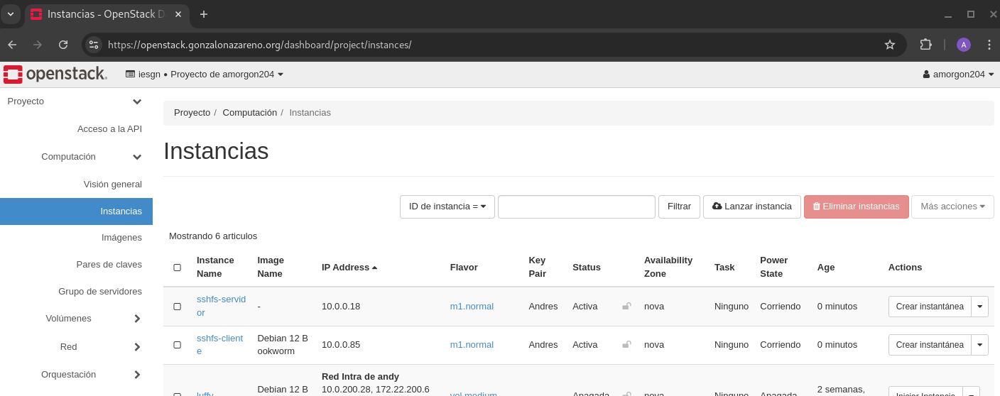
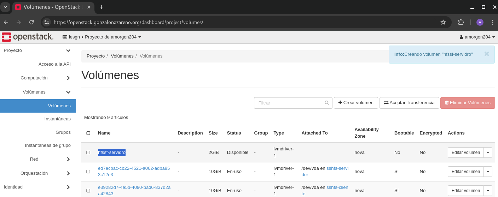

# Systemd/sshfs

## Enunciado

Crea dos instancias en OpenStack, basadas en la distribución de tu elección, anexa un volumen de 2GB.

Una de las instancias hará de servidor, donde anexarás el volumen anterior. Deberás configurar sshfs en el escenario, de tal forma que el cliente pueda montar el sistema de archivos remoto usando sshfs y systemd. La validación del usuario se realizará mediante clave pública/privada.

1. **Monta manualmente el sistema de archivos remoto.**

2. **Monta el sistema de archivos remoto de forma automática, mediante fichero /etc/fstab.**
   
3. **Monta el sistema de archivos remoto de forma automática, mediante fichero unidad .mount**

4. **Mediante fichero unidad .mount creado en el punto 3 y crea un fichero unidad de automontaje. unidad.automount, para que se monte automáticamente cuando detecte peticiones al sistema de archivos remoto y se desmonte automáticamente transcurrido un tiempo.**

****

## Ejercicio 1

Comenzaremos creando el escenario que necesitaremos para realizar la práctica, para ello usaremos dos instancias de Openstack, una de ellas actuará como **servidor** y la otra como **cliente**:



Anexaremos un volumen de **2 GB** a la máquina **servidor**:



Accederemos a ambas máquinas y generaremos un par de claves en ellas:

```
debian@sshfs-servidor:~$ ssh-keygen
Generating public/private rsa key pair.
Enter file in which to save the key (/home/debian/.ssh/id_rsa): 
Enter passphrase (empty for no passphrase): 
Enter same passphrase again: 
Your identification has been saved in /home/debian/.ssh/id_rsa
Your public key has been saved in /home/debian/.ssh/id_rsa.pub
The key fingerprint is:
SHA256:O4skAWy3sm7h9uRmkI/2qY4bMzNajGzMY+GHmvOeEz4 debian@sshfs-servidor
The key's randomart image is:
+---[RSA 3072]----+
|                 |
| .               |
|  + .            |
| . o .           |
| ...o   S        |
|=oBo .   .       |
|B%+Bo . o        |
|*@E+++ . o       |
|*XBO= . .        |
+----[SHA256]-----+

```

```
debian@sshfs-cliente:~$ ssh-keygen 
Generating public/private rsa key pair.
Enter file in which to save the key (/home/debian/.ssh/id_rsa): 
Enter passphrase (empty for no passphrase): 
Enter same passphrase again: 
Your identification has been saved in /home/debian/.ssh/id_rsa
Your public key has been saved in /home/debian/.ssh/id_rsa.pub
The key fingerprint is:
SHA256:hZEgFuVZ51BQ25ZzBiErCXJ/AOLK6rKh8Tl551uGoXY debian@sshfs-cliente
The key's randomart image is:
+---[RSA 3072]----+
|    *o*o*== o.   |
|   o * =.O = o   |
|    . o = * = o  |
| . .     + . +   |
|  o   . S        |
| .   . o         |
|+  .o E o        |
|++oo...o         |
|+ooo oo.         |
+----[SHA256]-----+
```

Comprobaremos que el volumen que anexamos anteriormente aparece en la máquina de forma correcta a través del siguiente comando:

```
debian@sshfs-servidor:~$ lsblk
NAME    MAJ:MIN RM  SIZE RO TYPE MOUNTPOINTS
vda     254:0    0   10G  0 disk 
├─vda1  254:1    0  9.9G  0 part /
├─vda14 254:14   0    3M  0 part 
└─vda15 254:15   0  124M  0 part /boot/efi
vdb     254:16   0    2G  0 disk
```
Usaremos ```fdisk``` para crear una nueva partición en el volumen ```vdb```:

```
debian@sshfs-servidor:~$ sudo fdisk /dev/vdb

Welcome to fdisk (util-linux 2.38.1).
Changes will remain in memory only, until you decide to write them.
Be careful before using the write command.

The device contains 'ext4' signature and it will be removed by a write command. See fdisk(8) man page and --wipe option for more details.

Device does not contain a recognized partition table.
Created a new DOS (MBR) disklabel with disk identifier 0xf7f2fad8.

Command (m for help): n
Partition type
   p   primary (0 primary, 0 extended, 4 free)
   e   extended (container for logical partitions)
Select (default p): p
Partition number (1-4, default 1): 1
First sector (2048-4194303, default 2048): 
Last sector, +/-sectors or +/-size{K,M,G,T,P} (2048-4194303, default 4194303): 

Created a new partition 1 of type 'Linux' and of size 2 GiB.

Command (m for help): w
The partition table has been altered.
Calling ioctl() to re-read partition table.
Syncing disks.
```

Comprobamos que la partición ha sido creada correctamente usando el comando ```lsblk```:

```
debian@sshfs-servidor:~$ lsblk
NAME    MAJ:MIN RM  SIZE RO TYPE MOUNTPOINTS
vda     254:0    0   10G  0 disk 
├─vda1  254:1    0  9.9G  0 part /
├─vda14 254:14   0    3M  0 part 
└─vda15 254:15   0  124M  0 part /boot/efi
vdb     254:16   0    2G  0 disk 
└─vdb1  254:17   0    2G  0 part 
```
Formateo la partición que acabo de crear con un sistema de arcgis **ext4**:
```debian@sshfs-servidor:~$ sudo mkfs.ext4 /dev/vdb1
mke2fs 1.47.0 (5-Feb-2023)
Discarding device blocks: done                            
Creating filesystem with 524032 4k blocks and 131072 inodes
Filesystem UUID: ba6dd1e3-a90e-4878-8c62-de9011ac9ab5
Superblock backups stored on blocks: 
	32768, 98304, 163840, 229376, 294912

Allocating group tables: done                            
Writing inode tables: done                            
Creating journal (8192 blocks): done
Writing superblocks and filesystem accounting information: done 
```

Creo el punto de montaje de la partición y la montamos en el directorio seleccionado:

```
debian@sshfs-servidor:~$ sudo mkdir -p /mount
debian@sshfs-servidor:~$ sudo mount /dev/vdb1 /mount
```

Verifico que la partición se ha montado correctamente en el directorio que hemos indicado:

```
debian@sshfs-servidor:~$ lsblk
NAME    MAJ:MIN RM  SIZE RO TYPE MOUNTPOINTS
vda     254:0    0   10G  0 disk 
├─vda1  254:1    0  9.9G  0 part /
├─vda14 254:14   0    3M  0 part 
└─vda15 254:15   0  124M  0 part /boot/efi
vdb     254:16   0    2G  0 disk 
└─vdb1  254:17   0    2G  0 part /mount
```

Creo un fichero que usaremos como prueba de los posteriores montajes en la máquina cliente llamado prueba.txt

```
debian@sshfs-servidor:/mount$ cat prueba.txt 
Feliz año Rafaeh
```

Instalo **sshfs** en ambas máquinas a través del siguiente comando:

```debian@sshfs-servidor:~$ sudo apt install sshfs```

Necesito tener la clave pública de la máquina cliente en el fichero authorized_keys de la máquina servidor para que el montaje funcione correctamente.

Usamos sshfs junto con las siguientes instrucciones; esto montará el sistema de archivos creado de la máquina servidor en la máquina cliente:
```debian@sshfs-cliente:~$ sshfs debian@10.0.0.18:/mount /home/debian/carpeta -o IdentityFile=/home/debian/.ssh/id_rsa```

**Donde los parámetros que necesitamos son los siguientes:**

- Dirección IP del servidor

- Punto de montaje en el servidor

- Punto de montaje en el cliente

- Clave pública del cliente
Usamos la instrucción df -h para comprobar que el montaje ha resultado exitoso:

```
debian@sshfs-cliente:~$ df -h
Filesystem                Size  Used Avail Use% Mounted on
udev                      462M     0  462M   0% /dev
tmpfs                      97M  512K   96M   1% /run
/dev/vda1                 9.7G  1.2G  8.1G  13% /
tmpfs                     481M     0  481M   0% /dev/shm
tmpfs                     5.0M     0  5.0M   0% /run/lock
/dev/vda15                124M   12M  113M  10% /boot/efi
tmpfs                      97M     0   97M   0% /run/user/1000
debian@10.0.0.18:/mount  2.0G   28K  1.9G   1% /home/debian/carpeta
```

**Comprobamos también que el fichero prueba.txt se encuentra tambíen en la máquina cliente:**

```
debian@sshfs-cliente:~$ cd carpeta/
debian@sshfs-cliente:~/carpeta$ ls
prueba.txt
debian@sshfs-cliente:~/carpeta$ cat prueba.txt 
Feliz año Rafaeh
```

## Ejercicio 2

Para realizar un montaje automático usando fstab, debemos modificar el fichero ```/etc/fstab``` de la máquina cliente, añadiendo la última línea que vemos a continuación:

```
debian@sshfs-cliente:~$ cat /etc/fstab 
PARTUUID=96dcada1-9ef2-4fc2-b051-5a58f5a0011d / ext4 rw,discard,errors=remount-ro,x-systemd.growfs 0 1
PARTUUID=eca597dd-9264-458e-8636-6fbea562607f /boot/efi vfat defaults 0 0

sshfs#debian@10.0.0.18:/mount /mnt/sshfs fuse defaults,_netdev,identityfile=/home/debian/.ssh/id_rsa,allow_other 0 0
```

Esta configuración monta un sistema de archivos remoto SSH en el punto de montaje local ```/mnt/sshfs```. Utiliza un usuario, una dirección IP y se accede a la carpeta remota utilizando el sistema de archivos FUSE; además, se realiza un proceso de identificación mediante una clave privada que se encuentra en ```/home/debian/.ssh/id_rsa```.

Creamos el punto de montaje que indicamos anteriormente en la máquina cliente:

```
debian@sshfs-cliente:~$ sudo mkdir -p /mnt/sshfs
debian@sshfs-cliente:~$ sudo chown debian:debian /mnt/sshfs
```

Tras efectuar un reinicio, comprobamos que el montaje se ha realizado de forma automática:

```
debian@sshfs-cliente:~$ df -h
Filesystem                Size  Used Avail Use% Mounted on
udev                      462M     0  462M   0% /dev
tmpfs                      97M  500K   96M   1% /run
/dev/vda1                 9.7G  1.2G  8.1G  13% /
tmpfs                     481M     0  481M   0% /dev/shm
tmpfs                     5.0M     0  5.0M   0% /run/lock
/dev/vda15                124M   12M  113M  10% /boot/efi
debian@10.0.0.18:/mount  2.0G   28K  1.9G   1% /mnt/sshfs
tmpfs                      97M     0   97M   0% /run/user/1000
```

Además, nos encontramos el fichero prueba.txt en el directorio indicado:

```
debian@sshfs-cliente:~$ cd /mnt/sshfs/
debian@sshfs-cliente:/mnt/sshfs$ cat prueba.txt 
Feliz año Rafaeh
```

## Ejercicio 3

Crearemos una unidad .mount en la ruta ```/etc/systemd/system/``` de la máquina cliente, indicando las claves y puntos de montaje necesarios de ambas máquinas:

```
debian@sshfs-cliente:~$ cat /etc/systemd/system/home-debian-sshfs.mount
[Unit]
Description=Montar sistema de archivos remoto SSHFS

[Mount]
What=debian@10.0.0.18:/mount
Where=/home/debian/sshfs
Type=fuse.sshfs
Options=_netdev,IdentityFile=/home/debian/.ssh/id_rsa,allow_other,default_permissions,reconnect
```

Reinicio para que se ejecuten los cambios e iniciamos la unidad que acabamos de crear:

```
debian@sshfs-cliente:~$ sudo systemctl daemon-reload
debian@sshfs-cliente:~$ sudo systemctl enable home-debian-sshfs.mount
The unit files have no installation config (WantedBy=, RequiredBy=, Also=,
Alias= settings in the [Install] section, and DefaultInstance= for template
units). This means they are not meant to be enabled using systemctl.
 
Possible reasons for having this kind of units are:
• A unit may be statically enabled by being symlinked from another unit's
  .wants/ or .requires/ directory.
• A unit's purpose may be to act as a helper for some other unit which has
  a requirement dependency on it.
• A unit may be started when needed via activation (socket, path, timer,
  D-Bus, udev, scripted systemctl call, ...).
• In case of template units, the unit is meant to be enabled with some
  instance name specified.
debian@sshfs-cliente:~$ sudo systemctl start home-debian-sshfs.mount
```

Comprobamos que el montaje se ha realizado de forma automática:

```
debian@sshfs-cliente:~$ df -h
Filesystem                Size  Used Avail Use% Mounted on
udev                      462M     0  462M   0% /dev
tmpfs                      97M  500K   96M   1% /run
/dev/vda1                 9.7G  1.2G  8.1G  13% /
tmpfs                     481M     0  481M   0% /dev/shm
tmpfs                     5.0M     0  5.0M   0% /run/lock
/dev/vda15                124M   12M  113M  10% /boot/efi
tmpfs                      97M     0   97M   0% /run/user/1000
debian@10.0.0.18:/mount  2.0G   28K  1.9G   1% /home/debian/sshfs
```

Además, nos encontramos el fichero prueba.txt en el directorio indicado:

```
debian@sshfs-cliente:~$ cd sshfs/
debian@sshfs-cliente:~/sshfs$ cat prueba.txt 
Feliz año Rafaeh
```

## Ejercicio 4

Crearemos una nueva unidad de automontaje, en la que determinaremos la unidad que creamos en el ejercicio anterior, además del nuevo punto de montaje y el tiempo en el que se desmontará automáticamente en segundos:

```
debian@sshfs-cliente:~$ cat /etc/systemd/system/home-debian-sshfs.automount
[Unit]
Description=Montar sistema de archivos remoto SSHFS
Requires=home-debian-sshfs.mount

[Automount]
Where=/home/debian/sshfs
TimeoutIdleSec=900
```

Reiniciamos para que se ejecuten los cambios e iniciamos la unidad que acabamos de crear:

```
debian@sshfs-cliente:~$ sudo systemctl daemon-reload
debian@sshfs-cliente:~$ sudo systemctl enable home-debian-sshfs.automount
The unit files have no installation config (WantedBy=, RequiredBy=, Also=,
Alias= settings in the [Install] section, and DefaultInstance= for template
units). This means they are not meant to be enabled using systemctl.
 
Possible reasons for having this kind of units are:
• A unit may be statically enabled by being symlinked from another unit's
  .wants/ or .requires/ directory.
• A unit's purpose may be to act as a helper for some other unit which has
  a requirement dependency on it.
• A unit may be started when needed via activation (socket, path, timer,
  D-Bus, udev, scripted systemctl call, ...).
• In case of template units, the unit is meant to be enabled with some
  instance name specified.
debian@sshfs-cliente:~$ sudo systemctl start home-debian-sshfs.automount
```

Comprobamos que el montaje se ha realizado de forma automática:

```
debian@sshfs-cliente:~$ df -h
Filesystem                Size  Used Avail Use% Mounted on
udev                      462M     0  462M   0% /dev
tmpfs                      97M  500K   96M   1% /run
/dev/vda1                 9.7G  1.2G  8.1G  13% /
tmpfs                     481M     0  481M   0% /dev/shm
tmpfs                     5.0M     0  5.0M   0% /run/lock
/dev/vda15                124M   12M  113M  10% /boot/efi
debian@10.0.0.18:/mount  2.0G   28K  1.9G   1% /home/debian/sshfs
tmpfs                      97M     0   97M   0% /run/user/1000
```

Además, nos encontramos el fichero prueba.txt en el directorio indicado:

```
debian@sshfs-cliente:~$ cd sshfs/
debian@sshfs-cliente:~/sshfs$ cat prueba.txt 
Feliz año Rafaeh
```