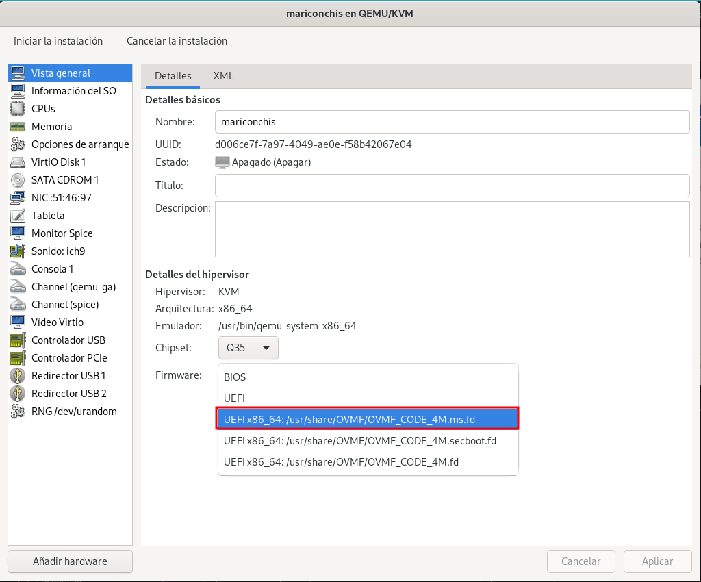

# Debian 13 Trixie

## Descripción

Los desarrolladores de Debian han propuesto el uso de systemd-boot para instalaciones UEFI de Debian Trixie, que se lanzará en 2025. Opción disponible, de momento, en instalaciones debian 13 en modo experto. El objetivo es agregar soporte de arranque seguro firmado a Debian para intentar resolver el problema relacionado con UEFI y Secure Boot con sistemas Debian. Proponen utilizar un gestor de arranque llamado “systemd-boot” para mejorar el proceso de arranque de Debian en sistemas UEFI.

## Instalación en una máquina virtual, debian 13 (Trixie) con systemd-boot, y familiarízate con este nuevo gestor de arranque.

En esta sección del artículo, veremos cómo instalar Debian 13 (Trixie) con el gestor de arranque systemd-boot en un sistema UEFI.

Comenzamos descargando la imagen ISO de Debian 13 Trixie desde el sitio oficial del proyecto [Debian](https://www.debian.org/devel/debian-installer/). Aquí seleccionaremos la opción que mejor se ajuste a nuestras necesidades, en mi caso la versión netinst.

Para esta instalación, usaremos QEMU/KVM como plataforma de virtualización para crear la máquina virtual. Es crucial configurar correctamente UEFI antes de iniciar la instalación, ya que Debian 13 utiliza este modo de arranque junto con systemd-boot.
Antes de ponernos en la instalación tendremos que elegir el siguiente

 
 
 
 
 
 
 
 
 
 
 
 
 
 
 
 
 
 
 

 
