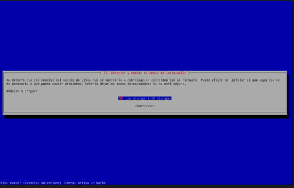
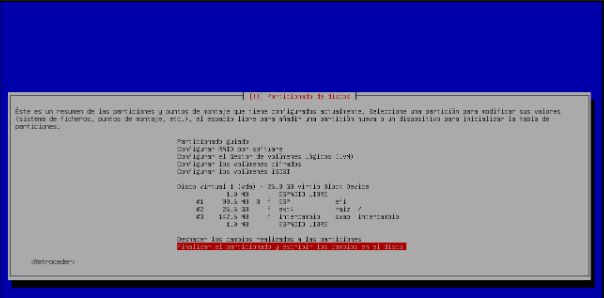

# Debian 13 Trixie

## Descripción

Los desarrolladores de Debian han propuesto el uso de systemd-boot para instalaciones UEFI de Debian Trixie, que se lanzará en 2025. Opción disponible, de momento, en instalaciones debian 13 en modo experto. El objetivo es agregar soporte de arranque seguro firmado a Debian para intentar resolver el problema relacionado con UEFI y Secure Boot con sistemas Debian. Proponen utilizar un gestor de arranque llamado “systemd-boot” para mejorar el proceso de arranque de Debian en sistemas UEFI.

## Instalación en una máquina virtual, debian 13 (Trixie) con systemd-boot, y familiarízate con este nuevo gestor de arranque.

En esta sección del artículo, veremos cómo instalar Debian 13 (Trixie) con el gestor de arranque systemd-boot en un sistema UEFI.

Comenzamos descargando la imagen ISO de Debian 13 Trixie desde el sitio oficial del proyecto [Debian](https://www.debian.org/devel/debian-installer/). Aquí seleccionaremos la opción que mejor se ajuste a nuestras necesidades, en mi caso la versión netinst.

Para esta instalación, usaremos QEMU/KVM como plataforma de virtualización para crear la máquina virtual. Es crucial configurar correctamente UEFI antes de iniciar la instalación, ya que Debian 13 utiliza este modo de arranque junto con systemd-boot.

Antes de ponernos en la instalación tendremos que elegir el siguiente:

Para asegurarnos de que systemd-boot se instale correctamente en Debian 13, también llamado **Trixie**, es imprescindible seleccionar la instalación en modo experto. Esto nos permitirá elegir manualmente el gestor de arranque y realizar configuraciones avanzadas.

Por lo que tenemos que seleccionar la opción estándar Install, elegimos “``Advanced options``” y luego “``Expert install``”.

Durante la instalación en modo experto de Debian 13, el instalador puede ofrecer una opción llamada “Detectar y montar el medio de instalación”. Esta opción es especialmente útil si estamos utilizando una instalación por red o un medio de instalación que no es el disco duro local (por ejemplo, un USB o una ISO montada). Por lo tanto, seleccionamos la que nos muestra automáticamente.

Seguidamente nos mostrará una serie de componentes opcionales para descargarlos en caso de ser necesarios. Yo personalmente no he seleccionado ninguno, pues para el objetivo de esta práctica no nos hará falta:

Luego, nos pedirá como queremos configurar la red, elegimos automáticamente:

Una vez elegido este paso, procederemos con la instalación de la forma habitual. Sin embargo, al llegar al apartado del particionado de discos, será necesario detenernos.

El proceso de particionado del disco es uno de los momentos más importantes durante la instalación de Debian, especialmente cuando se configura un sistema UEFI. En este punto, es fundamental establecer correctamente las particiones para garantizar que Debian se instale adecuadamente y utilice systemd-boot como gestor de arranque.

Por esta razón, es necesario optar por un particionado manual, ya que ofrece un control completo sobre la organización del disco.

A continuación, seleccionaremos el disco en el que realizaremos el particionado, que en este caso será el único disponible:

 

Nos preguntará que si queremos particionar el disco y le diremos que “Sí”, luego nos dará a elegir que tipo de tabla de partición vamos a utilizar. En este caso seleccionamos ``gpt``:
 

Ahora, debemos realizar el particionado, el cual yo haré de la siguiente forma:

- Partición EFI:
- Tipo: EFI System Partition
- Tamaño recomendado: Al menos 100 MB, aunque se recomienda entre 300 MB y 500 MB para asegurar un arranque adecuado.
- Punto de montaje: /boot/efi

Esta partición es crucial para UEFI, ya que contiene los archivos del cargador de arranque, como systemd-boot.
- Partición raíz (/):
- Tipo: ext4
- Tamaño recomendado: Al menos 20 GB o más
- Punto de montaje: /

Esta partición contendrá el sistema operativo y todos los archivos de configuración.

- Área de intercambio (swap):
  - Tipo: Linux swap
  - Tamaño recomendado: el tamaño será el restante, en este caso 142MB.
Esta partición es utilizada como espacio de intercambio cuando la RAM se llena.

 

Después de haber creado y configurado las particiones, el instalador nos solicitará confirmar el esquema de particionado. Si todo está en orden, seleccionaremos "Sí" para aplicar los cambios. Este paso formateará el disco y creará las particiones que hemos configurado.

Una vez completado el particionado, pasaremos a la instalación del sistema base. En este punto, se nos dará la opción de elegir el núcleo que deseamos instalar. En mi caso, opté por seleccionar la segunda opción:

 

A continuación, el instalador nos pedirá seleccionar una opción relacionada con los controladores. En mi caso, optaré por la opción "dirigido", ya que para esta práctica no es necesario cargar una gran cantidad de drivers.

 

Al llegar al punto del proceso de instalación en el que se nos pregunta si deseamos analizar medios de instalación adicionales, es fundamental seleccionar "No".

Esta opción permite al instalador buscar e instalar paquetes adicionales desde otros medios, como discos o dispositivos USB que contengan paquetes de instalación. Sin embargo, en la mayoría de los casos, esto no será necesario si ya contamos con una imagen ISO completa o estamos realizando una instalación a través de la red.

Cuando lleguemos a la opción de “¿Desea utilizar una réplica en red?” durante la instalación, es importante seleccionar “Sí”.

 

En este punto, el instalador nos ofrece la opción de utilizar una réplica en red (mirror) para descargar paquetes adicionales y actualizaciones durante la instalación. Esto es especialmente útil cuando se está utilizando una imagen de instalación mínima (netinst), ya que el sistema base instalado inicialmente será bastante limitado.

Al seleccionar "Sí", podremos conectarnos a una réplica en red que nos proporcionará los paquetes necesarios para completar la instalación y actualizar el sistema. Esto asegurará que el sistema Debian instalado sea completamente funcional y esté al día.

Después de activar esta opción, seleccionaremos HTTP como el protocolo para acceder a la réplica en red.

 

En esta etapa del proceso de instalación, se nos preguntará si deseamos utilizar firmware no libre para garantizar el correcto funcionamiento de ciertos componentes de hardware, como tarjetas Wi-Fi, chipsets de audio, entre otros.

El firmware no libre es esencial para que algunos dispositivos funcionen, aunque no cumple con los principios del software libre. Debian lo pone a disposición para ampliar la compatibilidad con diversos tipos de hardware, a pesar de que sus licencias limitan la libertad de usar, modificar o distribuir el software.

Si seleccionamos "Sí", el instalador cargará y utilizará los firmwares no libres necesarios para que el hardware funcione correctamente, algo especialmente útil si estamos trabajando con dispositivos específicos que dependen de controladores no libres.

 
 
 

### Configuración de Servicios de Actualización

En esta etapa del proceso de instalación, se nos preguntará si deseamos habilitar ciertos servicios de actualización para nuestro sistema Debian. Debian ofrece tres opciones principales relacionadas con las actualizaciones:

#### Actualizaciones de seguridad
Este servicio es esencial para proteger el sistema contra vulnerabilidades de seguridad. Debian recomienda encarecidamente activar esta opción, ya que permite recibir actualizaciones diseñadas para solucionar posibles fallos de seguridad en el sistema.

#### Actualizaciones de la distribución
Este servicio proporciona versiones más recientes de los paquetes del sistema que incluyen cambios importantes. Mantener este servicio habilitado garantiza que el sistema esté al día con las últimas versiones estables de los paquetes disponibles.

#### Programas migrados a nuevas versiones (opcional)
Esta opción permite acceder a versiones más recientes de programas que están en desarrollo o han sido migrados recientemente. Sin embargo, estos paquetes pueden no ser completamente estables, ya que aún están en fase de pruebas, aunque pueden incluir nuevas características.

Por defecto, dejamos habilitadas las dos primeras opciones: **Actualizaciones de seguridad** y **Actualizaciones de la distribución**, tal como se sugiere.

 
 

En la selección de programas elegiremos a nuestro gusto:

 

### Selección del Cargador de Arranque

Después de varios minutos durante los cuales el instalador descarga e instala los paquetes del sistema, alcanzamos una de las etapas más importantes de la instalación: la elección del cargador de arranque.

El cargador de arranque es un software crítico que permite iniciar el sistema operativo al encender el equipo. Por defecto, Debian utiliza **GRUB** como su gestor de arranque estándar. Sin embargo, en esta instalación estamos configurando **systemd-boot**, un gestor de arranque más ligero y moderno, diseñado específicamente para sistemas UEFI.

 

Después de completar la instalación del sistema y llegar al momento del reinicio, es necesario desactivar el “Secure Boot” en el firmware UEFI para que el cargador de arranque systemd-boot funcione correctamente.

### ¿Por qué desactivar Secure Boot?

El Secure Boot es una característica de UEFI diseñada para evitar que se cargue software no firmado o malicioso al iniciar el sistema. Sin embargo, en algunos casos, como al instalar Debian con systemd-boot, el firmware puede bloquear el arranque si el sistema operativo no está firmado digitalmente o no es compatible con el Secure Boot.

systemd-boot es un gestor de arranque que no siempre es compatible con Secure Boot de forma predeterminada, por lo que es necesario desactivarlo para permitir que el sistema se inicie correctamente.

Para desactivarlo seguimos los pasos de las siguientes capturas:

 
 
 

Guardamso los cambios con **F10** y le damos a **COnitune** y con eso iniciamos el sistema:

UNa vez de dentro comprobamos que es el sistema operativo que hemos elegido y apañao:

