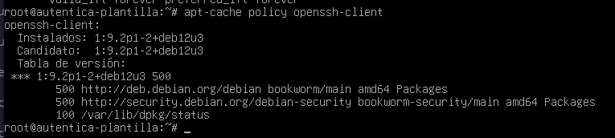

# Comandos apt, aptitude, dpkg

- En este ejercicio vamos a coger la tarea y vamos a trabajar con **apt, aptitude, dkpg** , esto lo haremos con una máquina virtual.

1. Que acciones consigo al realizar apt update y apt upgrade. Explica detalladamente.

**apt update**: Actualiza el índice de paquetes disponibles desde los repositorios configurados en /etc/apt/sources.list. 
                No instala ni actualiza paquetes,solo descarga las listas de versiones disponibles de los paquetes.

            - Detalle del proceso:
                                El sistema consulta los repositorios y descarga la información sobre versiones nuevas de los paquetes disponibles.
                                No actualiza ni instala nada, solo informa de los posibles paquetes que tienen versiones nuevas.

**apt upgrade**: Actualiza todos los paquetes que tienen una versión más reciente, pero sin eliminar paquetes instalados ni instalar nuevos paquetes.
            
            - Detalle del proceso:
                                Se descarga la versión actualizada de los paquetes instalados que tienen una nueva versión disponible.  
                                Si hay conflictos o si es necesario instalar nuevos paquetes, no los resuelve automáticamente.
   
. 
2. Lista la relación de paquetes que pueden ser actualizados. ¿Qué información puedes sacar a tenor de lo mostrado en el listado?.

Usaremos el comando **apt list --upgradable**

Con el cual obtendremos la siguiente información:

- Nombre del paquete.
- Versión instalada.
- Versión disponible para actualizar.
- El repositorio desde donde se instalaría la actualización.

3. Indica la versión instalada, candidata así como la prioridad del paquete openssh-client.

1. ¿Cómo puedes sacar información de un paquete oficial instalado o que no este instalado?

- Para sacar los paquetes instalados:
'''
root@autentica-plantilla:~# **apt show netcat-openbsd** 
Package: netcat-openbsd
Version: 1.219-1
Priority: optional
Section: net
Maintainer: Guilhem Moulin <guilhem@debian.org>
Installed-Size: 111 kB
Provides: netcat
Depends: libbsd0 (>= 0.2.0), libc6 (>= 2.34)
Breaks: netcat (<< 1.10-35)
Replaces: netcat (<< 1.10-35)
Tag: implemented-in::c, interface::commandline, network::client,
 protocol::ip, protocol::ipv6, protocol::tcp, protocol::udp,
 role::program, scope::utility, suite::bsd, use::transmission,
 works-with::network-traffic
Download-Size: 41,5 kB
APT-Manual-Installed: yes
APT-Sources: http://deb.debian.org/debian bookworm/main amd64 Packages
Description: TCP/IP swiss army knife
 A simple Unix utility which reads and writes data across network connections
 using TCP or UDP protocol. It is designed to be a reliable "back-end" tool
 that can be used directly or easily driven by other programs and scripts. At
 the same time it is a feature-rich network debugging and exploration tool,
 since it can create almost any kind of connection you would need and has
 several interesting built-in capabilities.
 .
 This package contains the OpenBSD rewrite of netcat, including support for
 IPv6, proxies, and Unix sockets.

'''

- Para paquetes no instalados:

'''
root@autentica-plantilla:~# **apt-cache show apache2**
Package: apache2
Version: 2.4.62-1~deb12u1
Installed-Size: 573
Maintainer: Debian Apache Maintainers <debian-apache@lists.debian.org>
Architecture: amd64
Provides: httpd, httpd-cgi
Depends: apache2-bin (= 2.4.62-1~deb12u1), apache2-data (= 2.4.62-1~deb12u1), apache2-utils (= 2.4.62-1~deb12u1), lsb-base, media-types, perl:any, procps
Pre-Depends: init-system-helpers (>= 1.54~)
Recommends: ssl-cert
Suggests: apache2-doc, apache2-suexec-pristine | apache2-suexec-custom, www-browser
Description-es: servidor HTTP Apache
 El objetivo del proyecto servidor HTTP Apache es construir un servidor HTTP
 seguro, eficiente y extensible como software de código abierto compatible
 con los estándares. El resultado ha sido durante mucho tiempo el servidor
 web número uno en Internet.
 .
 El resultado de la instalación de este paquete es una instalación completa,
 incluyendo los archivos de configuración, los scripts de inicio y los
 scripts de asistencia.
Description-md5: d02426bc360345e5acd45367716dc35c
Homepage: https://httpd.apache.org/
Tag: role::metapackage, suite::apache
Section: httpd
Priority: optional
Filename: pool/main/a/apache2/apache2_2.4.62-1~deb12u1_amd64.deb
Size: 222584
MD5sum: da8ec5e22d4e16c9adb01a414bb9e8cd
SHA256: d7cf4b47b86e7295bd64f568f038e5cbc475d371a3724f72e47a4f6d53bdc3f3

Package: apache2
Version: 2.4.61-1~deb12u1
Installed-Size: 573
Maintainer: Debian Apache Maintainers <debian-apache@lists.debian.org>
Architecture: amd64
Provides: httpd, httpd-cgi
Depends: apache2-bin (= 2.4.61-1~deb12u1), apache2-data (= 2.4.61-1~deb12u1), apache2-utils (= 2.4.61-1~deb12u1), lsb-base, media-types, perl:any, procps
Suggests: apache2-doc, apache2-suexec-pristine | apache2-suexec-custom, www-browser
Description-es: servidor HTTP Apache
 El objetivo del proyecto servidor HTTP Apache es construir un servidor HTTP
 seguro, eficiente y extensible como software de código abierto compatible
 con los estándares. El resultado ha sido durante mucho tiempo el servidor
 web número uno en Internet.
 .
 El resultado de la instalación de este paquete es una instalación completa,
 incluyendo los archivos de configuración, los scripts de inicio y los
 scripts de asistencia.
Description-md5: d02426bc360345e5acd45367716dc35c
Homepage: https://httpd.apache.org/
Pre-Depends: init-system-helpers (>= 1.54~)
Recommends: ssl-cert
Section: httpd
Priority: optional
Filename: pool/updates/main/a/apache2/apache2_2.4.61-1~deb12u1_amd64.deb
Size: 222088
SHA256: 531548edb3e768efc652f288e6e9f916e7f0f3188feb5dceb08bed3d086845bb

'''

5. Saca toda la información que puedas del paquete openssh-client que tienes actualmente instalado en tu máquina.
'''
root@autentica-plantilla:~# **apt show openssh-client**
Package: openssh-client
Version: 1:9.2p1-2+deb12u3
Priority: standard
Section: net
Source: openssh
Maintainer: Debian OpenSSH Maintainers <debian-ssh@lists.debian.org>
Installed-Size: 5.919 kB
Provides: ssh-client
Depends: adduser, passwd, libc6 (>= 2.36), libedit2 (>= 2.11-20080614-0), libfido2-1 (>= 1.8.0), libgssapi-krb5-2 (>= 1.17), libselinux1 (>= 3.1~), libssl3 (>= 3.0.13), zlib1g (>= 1:1.1.4)
Recommends: xauth
Suggests: keychain, libpam-ssh, monkeysphere, ssh-askpass
Conflicts: sftp
Breaks: openssh-sk-helper
Replaces: openssh-sk-helper, ssh, ssh-krb5
Homepage: https://www.openssh.com/
Tag: implemented-in::c, interface::commandline, interface::shell,
 network::client, protocol::sftp, protocol::ssh, role::program,
 security::authentication, security::cryptography, uitoolkit::ncurses,
 use::login, use::transmission, works-with::file
Download-Size: 991 kB
APT-Manual-Installed: yes
APT-Sources: http://deb.debian.org/debian bookworm/main amd64 Packages
Description: Cliente del protocolo "Secure Shell" (SSH) para acceso seguro a máquinas remotas
 Esta es la versión adaptable de OpenSSH, una implementación libre del
 protocolo «Secure Shell» como especifica el grupo de trabajo secsh del IETF.
 .
 Ssh (Secure Shell) es una aplicación para acceder y ejecutar comandos 
 en una máquina remota. Provee conexiones encriptadas y seguras entre dos
 huéspedes no certificados en una red sin seguridad. Las conexiones a través
 de X11 y puertos arbitrarios TCP/IP también pueden ser transportados a un
 canal seguro. Puede ser usado para proveer a las aplicaciones de un canal de
 comunicación seguro.
 .
 Este paquete proporciona los clientes de ssh, scp y sftp, los programas
 sh-agent y ssh-add para hacer más comoda la autenticación de clave pública,
 y las utilidades ssh-keygen, ssh-keyscan, ssh-copy-id y ssh-argv0.
 .
 En algunos países puede ser ilegal utilizar cualquier tipo de cifrado sin
 un permiso especial.
 .
 ssh reemplaza a las aplicaciones no seguras rsh, rcp y rlogin, 
 obsoletas para la mayoría de los propósitos.

 '''

6. Saca toda la información que puedas del paquete openssh-client candidato a actualizar en tu máquina.

'''
root@autentica-plantilla:~# **apt-cache policy openssh-client**
openssh-client:
  Instalados: 1:9.2p1-2+deb12u3
  Candidato:  1:9.2p1-2+deb12u3
  Tabla de versión:
 *** 1:9.2p1-2+deb12u3 500
        500 http://deb.debian.org/debian bookworm/main amd64 Packages
        500 http://security.debian.org/debian-security bookworm-security/main amd64 Packages
        100 /var/lib/dpkg/status
'''

7. Lista todo el contenido referente al paquete openssh-client actual de tu máquina. Utiliza para ello tanto dpkg como apt.

- Primero vamos a listar los archivos instalados:
'''
root@autentica-plantilla:~# **dpkg -L openssh-client**
/.
/etc
/etc/ssh
/etc/ssh/ssh_config
/etc/ssh/ssh_config.d
/usr
/usr/bin
/usr/bin/scp
/usr/bin/sftp
/usr/bin/ssh
/usr/bin/ssh-add
/usr/bin/ssh-agent
/usr/bin/ssh-argv0
/usr/bin/ssh-copy-id
/usr/bin/ssh-keygen
/usr/bin/ssh-keyscan
/usr/lib
/usr/lib/openssh
/usr/lib/openssh/agent-launch
/usr/lib/openssh/ssh-keysign
/usr/lib/openssh/ssh-pkcs11-helper
/usr/lib/openssh/ssh-sk-helper
/usr/lib/systemd
/usr/lib/systemd/user
/usr/lib/systemd/user/graphical-session-pre.target.wants
/usr/lib/systemd/user/ssh-agent.service
/usr/share
/usr/share/apport
/usr/share/apport/package-hooks
/usr/share/apport/package-hooks/openssh-client.py
/usr/share/doc
/usr/share/doc/openssh-client
/usr/share/doc/openssh-client/NEWS.Debian.gz
/usr/share/doc/openssh-client/OVERVIEW.gz
/usr/share/doc/openssh-client/README
/usr/share/doc/openssh-client/README.Debian.gz
/usr/share/doc/openssh-client/README.dns
/usr/share/doc/openssh-client/README.tun.gz
/usr/share/doc/openssh-client/changelog.Debian.gz
/usr/share/doc/openssh-client/changelog.gz
/usr/share/doc/openssh-client/copyright
/usr/share/lintian
/usr/share/lintian/overrides
/usr/share/lintian/overrides/openssh-client
/usr/share/man
/usr/share/man/man1
/usr/share/man/man1/scp.1.gz
/usr/share/man/man1/sftp.1.gz
/usr/share/man/man1/ssh-add.1.gz
/usr/share/man/man1/ssh-agent.1.gz
/usr/share/man/man1/ssh-argv0.1.gz
/usr/share/man/man1/ssh-copy-id.1.gz
/usr/share/man/man1/ssh-keygen.1.gz
/usr/share/man/man1/ssh-keyscan.1.gz
/usr/share/man/man1/ssh.1.gz
/usr/share/man/man5
/usr/share/man/man5/ssh_config.5.gz
/usr/share/man/man8
/usr/share/man/man8/ssh-keysign.8.gz
/usr/share/man/man8/ssh-pkcs11-helper.8.gz
/usr/share/man/man8/ssh-sk-helper.8.gz
/usr/bin/slogin
/usr/lib/systemd/user/graphical-session-pre.target.wants/ssh-agent.service
/usr/share/man/man1/slogin.1.gz
'''

- Segundo vamos a mostarr la información del paquete:

'''
root@autentica-plantilla:~# **apt show openssh-client**
Package: openssh-client
Version: 1:9.2p1-2+deb12u3
Priority: standard
Section: net
Source: openssh
Maintainer: Debian OpenSSH Maintainers <debian-ssh@lists.debian.org>
Installed-Size: 5.919 kB
Provides: ssh-client
Depends: adduser, passwd, libc6 (>= 2.36), libedit2 (>= 2.11-20080614-0), libfido2-1 (>= 1.8.0), libgssapi-krb5-2 (>= 1.17), libselinux1 (>= 3.1~), libssl3 (>= 3.0.13), zlib1g (>= 1:1.1.4)
Recommends: xauth
Suggests: keychain, libpam-ssh, monkeysphere, ssh-askpass
Conflicts: sftp
Breaks: openssh-sk-helper
Replaces: openssh-sk-helper, ssh, ssh-krb5
Homepage: https://www.openssh.com/
Tag: implemented-in::c, interface::commandline, interface::shell,
 network::client, protocol::sftp, protocol::ssh, role::program,
 security::authentication, security::cryptography, uitoolkit::ncurses,
 use::login, use::transmission, works-with::file
Download-Size: 991 kB
APT-Manual-Installed: yes
APT-Sources: http://deb.debian.org/debian bookworm/main amd64 Packages
Description: Cliente del protocolo "Secure Shell" (SSH) para acceso seguro a máquinas remotas
 Esta es la versión adaptable de OpenSSH, una implementación libre del
 protocolo «Secure Shell» como especifica el grupo de trabajo secsh del IETF.
 .
 Ssh (Secure Shell) es una aplicación para acceder y ejecutar comandos 
 en una máquina remota. Provee conexiones encriptadas y seguras entre dos
 huéspedes no certificados en una red sin seguridad. Las conexiones a través
 de X11 y puertos arbitrarios TCP/IP también pueden ser transportados a un
 canal seguro. Puede ser usado para proveer a las aplicaciones de un canal de
 comunicación seguro.
 .
 Este paquete proporciona los clientes de ssh, scp y sftp, los programas
 sh-agent y ssh-add para hacer más comoda la autenticación de clave pública,
 y las utilidades ssh-keygen, ssh-keyscan, ssh-copy-id y ssh-argv0.
 .
 En algunos países puede ser ilegal utilizar cualquier tipo de cifrado sin
 un permiso especial.
 .
 ssh reemplaza a las aplicaciones no seguras rsh, rcp y rlogin, 
 obsoletas para la mayoría de los propósitos.
 '''

8. Listar el contenido de un paquete sin la necesidad de instalarlo o descargarlo.

Para listar el contendio de un paquete **.deb** sin instalarlo o descargarlo:

Descargar un paquete sin instalarlo:

'''
root@autentica-plantilla:~# **apt-get download openssh-client**
Des:1 http://deb.debian.org/debian bookworm/main amd64 openssh-client amd64 1:9.2p1-2+deb12u3 [991 kB]
Descargados 991 kB en 0s (3.821 kB/s)
W: Download is performed unsandboxed as root as file '/root/openssh-client_1%3a9.2p1-2+deb12u3_amd64.deb' couldn't be accessed by user '_apt'. - pkgAcquire::Run (13: Permiso denegado)
'''

Listar el contenido sin instarlo:

'''
root@autentica-plantilla:~# **dpkg --contents openssh-client_1%3a9.2p1-2+deb12u3_amd64.deb**
drwxr-xr-x root/root         0 2024-06-22 21:38 ./
drwxr-xr-x root/root         0 2024-06-22 21:38 ./etc/
drwxr-xr-x root/root         0 2024-06-22 21:38 ./etc/ssh/
-rw-r--r-- root/root      1650 2024-06-22 21:38 ./etc/ssh/ssh_config
drwxr-xr-x root/root         0 2024-06-22 21:38 ./etc/ssh/ssh_config.d/
drwxr-xr-x root/root         0 2024-06-22 21:38 ./usr/
drwxr-xr-x root/root         0 2024-06-22 21:38 ./usr/bin/
-rwxr-xr-x root/root    273024 2024-06-22 21:38 ./usr/bin/scp
-rwxr-xr-x root/root    289376 2024-06-22 21:38 ./usr/bin/sftp
-rwxr-xr-x root/root   1125408 2024-06-22 21:38 ./usr/bin/ssh
-rwxr-xr-x root/root    526784 2024-06-22 21:38 ./usr/bin/ssh-add
-rwxr-xr-x root/root    481664 2024-06-22 21:38 ./usr/bin/ssh-agent
-rwxr-xr-x root/root      1455 2023-12-19 13:55 ./usr/bin/ssh-argv0
-rwxr-xr-x root/root     12676 2023-02-02 13:21 ./usr/bin/ssh-copy-id
-rwxr-xr-x root/root    661952 2024-06-22 21:38 ./usr/bin/ssh-keygen
-rwxr-xr-x root/root    633312 2024-06-22 21:38 ./usr/bin/ssh-keyscan
drwxr-xr-x root/root         0 2024-06-22 21:38 ./usr/lib/
drwxr-xr-x root/root         0 2024-06-22 21:38 ./usr/lib/openssh/
-rwxr-xr-x root/root       736 2023-12-19 13:55 ./usr/lib/openssh/agent-launch
-rwsr-xr-x root/root    653888 2024-06-22 21:38 ./usr/lib/openssh/ssh-keysign
-rwxr-xr-x root/root    469360 2024-06-22 21:38 ./usr/lib/openssh/ssh-pkcs11-helper
-rwxr-xr-x root/root    465264 2024-06-22 21:38 ./usr/lib/openssh/ssh-sk-helper
drwxr-xr-x root/root         0 2024-06-22 21:38 ./usr/lib/systemd/
drwxr-xr-x root/root         0 2024-06-22 21:38 ./usr/lib/systemd/user/
drwxr-xr-x root/root         0 2024-06-22 21:38 ./usr/lib/systemd/user/graphical-session-pre.target.wants/
-rw-r--r-- root/root       287 2023-12-19 13:55 ./usr/lib/systemd/user/ssh-agent.service
drwxr-xr-x root/root         0 2024-06-22 21:38 ./usr/share/
drwxr-xr-x root/root         0 2024-06-22 21:38 ./usr/share/apport/
drwxr-xr-x root/root         0 2024-06-22 21:38 ./usr/share/apport/package-hooks/
-rw-r--r-- root/root      1213 2024-06-22 21:38 ./usr/share/apport/package-hooks/openssh-client.py
drwxr-xr-x root/root         0 2024-06-22 21:38 ./usr/share/doc/
drwxr-xr-x root/root         0 2024-06-22 21:38 ./usr/share/doc/openssh-client/
-rw-r--r-- root/root      8678 2023-12-19 13:55 ./usr/share/doc/openssh-client/NEWS.Debian.gz
-rw-r--r-- root/root      2564 2023-02-02 13:21 ./usr/share/doc/openssh-client/OVERVIEW.gz
-rw-r--r-- root/root      2134 2023-02-02 13:21 ./usr/share/doc/openssh-client/README
-rw-r--r-- root/root      4772 2023-12-19 13:55 ./usr/share/doc/openssh-client/README.Debian.gz
-rw-r--r-- root/root      1615 2023-02-02 13:21 ./usr/share/doc/openssh-client/README.dns
-rw-r--r-- root/root      1854 2023-02-02 13:21 ./usr/share/doc/openssh-client/README.tun.gz
-rw-r--r-- root/root     25786 2024-06-22 21:38 ./usr/share/doc/openssh-client/changelog.Debian.gz
-rw-r--r-- root/root    133383 2023-02-02 13:24 ./usr/share/doc/openssh-client/changelog.gz
-rw-r--r-- root/root     10941 2023-12-19 13:55 ./usr/share/doc/openssh-client/copyright
drwxr-xr-x root/root         0 2024-06-22 21:38 ./usr/share/lintian/
drwxr-xr-x root/root         0 2024-06-22 21:38 ./usr/share/lintian/overrides/
-rw-r--r-- root/root        81 2023-12-19 13:55 ./usr/share/lintian/overrides/openssh-client
drwxr-xr-x root/root         0 2024-06-22 21:38 ./usr/share/man/
drwxr-xr-x root/root         0 2024-06-22 21:38 ./usr/share/man/man1/
-rw-r--r-- root/root      3356 2024-06-22 21:38 ./usr/share/man/man1/scp.1.gz
-rw-r--r-- root/root      6040 2024-06-22 21:38 ./usr/share/man/man1/sftp.1.gz
-rw-r--r-- root/root      4170 2024-06-22 21:38 ./usr/share/man/man1/ssh-add.1.gz
-rw-r--r-- root/root      3721 2024-06-22 21:38 ./usr/share/man/man1/ssh-agent.1.gz
-rw-r--r-- root/root       720 2024-06-22 21:38 ./usr/share/man/man1/ssh-argv0.1.gz
-rw-r--r-- root/root      3078 2024-06-22 21:38 ./usr/share/man/man1/ssh-copy-id.1.gz
-rw-r--r-- root/root     13114 2024-06-22 21:38 ./usr/share/man/man1/ssh-keygen.1.gz
-rw-r--r-- root/root      2145 2024-06-22 21:38 ./usr/share/man/man1/ssh-keyscan.1.gz
-rw-r--r-- root/root     15300 2024-06-22 21:38 ./usr/share/man/man1/ssh.1.gz
drwxr-xr-x root/root         0 2024-06-22 21:38 ./usr/share/man/man5/
-rw-r--r-- root/root     19054 2024-06-22 21:38 ./usr/share/man/man5/ssh_config.5.gz
drwxr-xr-x root/root         0 2024-06-22 21:38 ./usr/share/man/man8/
-rw-r--r-- root/root      1434 2024-06-22 21:38 ./usr/share/man/man8/ssh-keysign.8.gz
-rw-r--r-- root/root      1024 2024-06-22 21:38 ./usr/share/man/man8/ssh-pkcs11-helper.8.gz
-rw-r--r-- root/root      1025 2024-06-22 21:38 ./usr/share/man/man8/ssh-sk-helper.8.gz
lrwxrwxrwx root/root         0 2024-06-22 21:38 ./usr/bin/slogin -> ssh
lrwxrwxrwx root/root         0 2024-06-22 21:38 ./usr/lib/systemd/user/graphical-session-pre.target.wants/ssh-agent.service -> ../ssh-agent.service
lrwxrwxrwx root/root         0 2024-06-22 21:38 ./usr/share/man/man1/slogin.1.gz -> ssh.1.gz
'''
9.  Simula la instalación del paquete openssh-client.

Esto mopstarrar que pasa si se instala openssh-client, sin realizar ningun tipo de cambio real en el sistema, esto nos es util paara verificar que no haya ningún tipo de conflicto, y tambien para ver que dependencías nos hara falta.

root@autentica-plantilla:~# **apt-get --dry-run install openssh-client**
Leyendo lista de paquetes... Hecho
Creando árbol de dependencias... Hecho
Leyendo la información de estado... Hecho
openssh-client ya está en su versión más reciente (1:9.2p1-2+deb12u3).
0 actualizados, 0 nuevos se instalarán, 0 para eliminar y 0 no actualizados.

10. ¿Qué comando te informa de los posible bugs que presente un determinado paquete?

root@autentica-plantilla:~# **apt list --bugs openssh-client**
Listando... Hecho
openssh-client/stable,stable-security,now 1:9.2p1-2+deb12u3 amd64 [instalado]
root@autentica-plantilla:~# apt list --reportbug openssh-client

11.  Después de realizar un apt update && apt upgrade. Si quisieras actualizar únicamente los paquetes que tienen de cadena openssh. ¿Qué procedimiento seguirías?. Realiza esta acción, con las estructuras repetitivas que te ofrece bash, así como con el comando xargs.

Lo haría con el siguiente comando:

**apt list --upgradable | grep openssh | cut -d '/' -f 1 | xargs apt install -y**

root@autentica-plantilla:~# apt list --upgradable | grep openssh | cut -d '/' -f 1 | xargs apt install -y

WARNING: apt does not have a stable CLI interface. Use with caution in scripts.

Leyendo lista de paquetes... Hecho
Creando árbol de dependencias... Hecho
Leyendo la información de estado... Hecho
0 actualizados, 0 nuevos se instalarán, 0 para eliminar y 0 no actualizados.

Con esto tendriamos la lista de los paquetes que contienen "openssh" y los actualiza automaticamente.

12.  ¿Cómo encontrarías qué paquetes dependen de un paquete específico.

Con el comando **apt-cache rdepnds <nombre_del_paquete>**

Si lo hacemos como ejemplo, en openssh-client, nos saldra lo siguiente:

root@autentica-plantilla:~# apt-cache rdepends openssh-client
openssh-client
Reverse Depends:
  openssh-server
  git
  cockpit-tests
 |zssh
  xpra
  xen-tools
  x2goserver
  x2goclient
 |waypipe
  vorta
  vagrant
  unison-2.52-gtk
  unison-2.52
  unison-2.51+4.13.1-gtk
  unison-2.51+4.13.1
  tsung
  python3-tomahawk
  tla
  task-ssh-server
 |taktuk
  python3-jarabe
  ssvnc
 |sshuttle
  sshfs
  ssh-tools
  ssh-import-id
  ssh-cron
  ssh-contact-client
  ssh-agent-filter
  snapd
  smokeping
  slack
 |sisu
  simple-tpm-pk11
  sidedoor
  secpanel
  seahorse
  python3-sahara-plugin-vanilla
  python3-sahara-plugin-spark
  rsync
 |rsnapshot
  rsbackup-graph
  rsbackup
 |rancid
  pssh
 |pkg-perl-tools
  piuparts-slave-from-git-deps
  piuparts-slave
  pdudaemon
 |pdsh
  python3-parallax
  oz
  ostree-push
  openstack-cluster-installer-openstack-ci
  openssh-known-hosts
 |ssh-askpass-gnome
  ssh
  openssh-tests
  openssh-sftp-server
  openssh-server
  git-annex
 |openmpi-bin
  oar-user
  oar-server
  oar-node
  python3-nova
  network-manager-ssh
  mussh
  mssh
  mosh
  mercurial
 |lxsession
  lsh-server
  live-task-standard
  live-task-recommended
  libnetapp-perl
 |libnet-ssh-perl
 |libnet-sftp-foreign-perl
 |libnet-scp-perl
  libnet-openssh-perl
  libguestfs0
  libconfig-model-openssh-perl
  lftp
  lava-server
  lava
 |lam-runtime
  python3-labgrid
  kwalletcli
  ksshaskpass
 |keychain
  hollywood
  hash-slinger
  gitolite3
  git
 |ansible
  ganeti-3.0
 |gabedit
 |gabedit
 |fssync
  freedombox
  fence-agents
  fdroidserver
  fai-server
  duply
 |dupload
  dropbear-bin
  python3-dput
  dput
 |dish
  diffoscope-minimal
  diffoscope
  debvm
  debian-goodies
  cvs
  cockpit-tests
  clusterssh
  clonezilla
 |ckermit
  chkrootkit
  ceph-mgr-cephadm
  btrbk
  barman-cli
  barman
 |backuppc
  backup-manager
  backintime-common
  autossh
 |autossh
  apt-dater
 |ansible-core

13.  ¿Cómo procederías para encontrar el paquete al que pertenece un determinado fichero?

Usando el siguiinet comando **dpkg -S ruta_del_archivo**

Ejemplo:

root@autentica-plantilla:~# dpkg -S /usr/bin/ssh
openssh-client: /usr/bin/ssh

14. ¿Que procedimientos emplearías para liberar la caché en cuanto a descargas de paquetería?

- Para limpiar la caché de los paquetes descargados. usaria **apt clean**

- Para limpiar solo los archivos innecesarios, usaria **apt autoclean**

15. Realiza la instalación del paquete keyboard-configuration pasando previamente los valores de los parámetros de configuración como variables de entorno.

Para ello lo que haremso ser acrear una variable de entorno, para que no nos pida permiso de configuracion:

root@autentica-plantilla:~# DEBIAN_FRONTEND=noninteractive apt install keyboard-configuration
Leyendo lista de paquetes... Hecho
Creando árbol de dependencias... Hecho
Leyendo la información de estado... Hecho
keyboard-configuration ya está en su versión más reciente (1.221).
0 actualizados, 0 nuevos se instalarán, 0 para eliminar y 0 no actualizados.

16. Reconfigura el paquete locales de tu equipo, añadiendo una localización que no exista previamente. Comprueba a modificar las variables de entorno correspondientes para que la sesión del usuario utilice otra localización.

root@autentica-plantilla:~# dpkg-reconfigure locales
Generating locales (this might take a while)...
  aa_DJ.UTF-8... done
  aa_DJ.ISO-8859-1... done
  aa_ER.UTF-8... done
  aa_ER.UTF-8@saaho... done
  aa_ET.UTF-8... done
  af_ZA.UTF-8... done
  af_ZA.ISO-8859-1... done
  agr_PE.UTF-8... done
  ak_GH.UTF-8... done

Y a la hora de comprobación, pondemos lo siguiente que sera ajustar la sesion del usuario para que use la nueva localización:

root@autentica-plantilla:~# export LANG=en_US.UTF-8
root@autentica-plantilla:~# export LC_ALL=en_US.UTF-8
-bash: aviso: setlocale: LC_ALL: no se puede cambiar el local (en_US.UTF-8)

17. Interrumpe la configuración de un paquete y explica los pasos a dar para continuar la instalación.

Para continuar la instalacion de algún meteremos el siguinet comando:

**sudo dpkg --configure -a**

esto lo que hace es renaudar cualquier paquete que haya quedado en un estado inconsciente.

18. Explica la instrucción que utilizarías para hacer una actualización completa de todos los paquetes de tu sistema de manera completamente no interactiva

Usaria esta:

**LA_AMDRE_DEL_TOPO=noninteractive sudo apt full-upgrade -y**

Con esto lo que conseguimos es actualizar los paquetes del sistema sin soliciatr interaccion.
Verificación:

root@autentica-plantilla:~# A_AMDRE_DEL_TOPO=noninteractive apt full-upgrade -y
Reading package lists... Done
Building dependency tree... Done
Reading state information... Done
Calculating upgrade... Done
0 upgraded, 0 newly installed, 0 to remove and 0 not upgraded.
root@autentica-plantilla:~# 

19. Bloquea la actualización de determinados paquetes.

Para bloquear la actualización de un paquete especifico, usare:

**sudo apt-mark hold <nombre_paquete>**

Vamos a comprobarlo con openssh-client, con lo que evitaremos que sea actualizado cuando hagamos unh upgrade.

Verificación:

root@autentica-plantilla:~# apt-mark hold openssh-client
openssh-client set on hold.
root@autentica-plantilla:~# 

