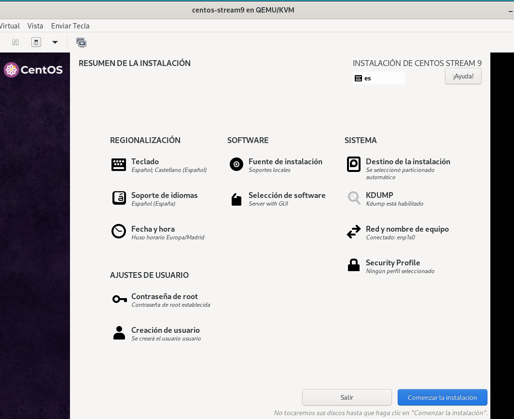

# Convulsión en el mundo del software libre

## Introducción

El ecosistema del software libre vivió una notable agitación en 2023, cuando Red Hat adoptó la polémica decisión de limitar el acceso público a los repositorios de CentOS Stream. Esta medida alteró de manera significativa el entorno de las distribuciones de Linux basadas en Red Hat Enterprise Linux (RHEL). Más allá de transformar el panorama de las distribuciones comunitarias, la decisión desencadenó un acalorado debate sobre los principios del software libre y la viabilidad de los modelos de negocio sustentados en código abierto.

Este trabajo examinará las decisiones de Red Hat y sus repercusiones en el modelo de negocio de la empresa, la evolución histórica de su relación con CentOS, y las reacciones de otras distribuciones comunitarias y empresariales. Además, se analizará el impacto de estas decisiones en el cumplimiento de la Licencia Pública General (GPL) y se estudiará la respuesta de proyectos como AlmaLinux, Rocky Linux y openSUSE frente a esta nueva realidad.

Finalmente, se llevará a cabo una evaluación práctica de las distribuciones RHEL, CentOS Stream, openSUSE Leap, AlmaLinux y Rocky Linux, comparando sus características, facilidad de uso y relevancia dentro del ecosistema actual del software libre. Este análisis proporcionará una visión más clara de cómo se ha reconfigurado el equilibrio entre el software libre y las estrategias comerciales en el sector tecnológico.

## Análisis de las acciones de Red Hat en junio de 2023 y su modelo de negocio

En junio de 2023, Red Hat implementó cambios importantes que tuvieron un impacto considerable en la comunidad de software libre, especialmente en lo relacionado con CentOS. Entre las decisiones más destacadas estuvo el cierre del acceso público a los repositorios de CentOS Stream, una distribución que anteriormente se había posicionado como una opción gratuita y compatible con RHEL. Este movimiento marcó un punto de inflexión, transformando a CentOS de una distribución estable y predecible a un modelo "rolling release" más alineado con el desarrollo de futuras versiones de RHEL, pero con menor estabilidad.

Este cambio forma parte de la estrategia de Red Hat para fortalecer su enfoque en RHEL y su modelo de negocio basado en suscripciones. Al limitar el acceso al código fuente de RHEL, Red Hat busca maximizar sus ingresos y reducir los costos asociados con las distribuciones comunitarias como CentOS. Este enfoque pone de manifiesto una clara prioridad hacia el producto empresarial de Red Hat, relegando a las distribuciones comunitarias a un papel más secundario y con opciones más limitadas.

## Relación entre Red Hat y CentOS en el pasado

CentOS nació como una distribución comunitaria derivada de RHEL, concebida para ofrecer una alternativa gratuita y completamente compatible con las versiones comerciales de Red Hat. Aunque CentOS no contaba con soporte oficial, su compatibilidad con RHEL lo convirtió en una elección popular entre empresas y servidores que buscaban una solución más económica. En 2014, Red Hat adquirió CentOS con el objetivo de fortalecer su presencia en el ecosistema de código abierto y proporcionar una versión gratuita de su sistema operativo.

Con el tiempo, el proyecto CentOS experimentó un cambio significativo en su dirección, evolucionando hacia CentOS Stream, una versión de desarrollo intermedia para RHEL. Muchos percibieron esta transición como un paso hacia un modelo más restringido, donde Red Hat podía ejercer mayor control sobre las versiones futuras de RHEL.


## Reacciones de las distribuciones comunitarias y empresariales

Las respuestas de las distribuciones comunitarias y empresariales ante los cambios realizados por Red Hat fueron variadas:

- **AlmaLinux y Rocky Linux**: Ambas surgieron como alternativas comunitarias tras la transición de CentOS a CentOS Stream. Estos proyectos están basados en el código fuente de RHEL y buscan ofrecer opciones completamente compatibles con RHEL, sin las restricciones comerciales introducidas por Red Hat.

- **openSUSE**: Aunque openSUSE no depende de Red Hat, su comunidad mostró preocupación por el impacto de estos cambios en el ecosistema de software libre. **openSUSE Leap** sigue siendo una opción sólida y confiable para quienes buscan un sistema basado en software libre con menos influencia de Red Hat. Por su parte, **openSUSE Tumbleweed** ofrece una experiencia de "rolling release".

- **Oracle Linux**: Oracle adoptó una postura crítica frente a las decisiones de Red Hat. Al igual que AlmaLinux y Rocky Linux, **Oracle Linux** está basado en RHEL, pero Oracle pone énfasis en ofrecer soporte empresarial sin las restricciones aplicadas por Red Hat.

## ¿Dónde queda la GPL?

A pesar de las restricciones comerciales implementadas por Red Hat, la Licencia Pública General (GPL) sigue siendo aplicable. Tanto RHEL como CentOS Stream son distribuciones de código abierto, lo que obliga a Red Hat a cumplir con la GPL y proporcionar acceso al código fuente. Sin embargo, la estrategia de cobrar por el acceso a versiones estables y comerciales de RHEL parece contradecir el espíritu de la GPL, que promueve la libre distribución y modificación del software.

## Situación actual en el ecosistema Red Hat

Actualmente, RHEL se mantiene como el núcleo del modelo de negocio de Red Hat, basado en suscripciones. **CentOS Stream** se ha convertido en una distribución intermedia dirigida a desarrolladores que necesitan acceso a futuras versiones de RHEL, aunque con menor estabilidad. Ante este escenario, la comunidad ha reaccionado con proyectos como AlmaLinux y Rocky Linux, que han tomado el lugar de CentOS como alternativas gratuitas y compatibles con RHEL. Estas iniciativas han logrado atraer a usuarios y empresas que buscan opciones sin coste y adaptadas a las necesidades empresariales.

## Situación actual en el ecosistema openSUSE

El ecosistema de openSUSE se mantiene robusto y estable. **openSUSE Leap**, basado en SUSE Linux Enterprise, sigue siendo una de las opciones más confiables para servidores y estaciones de trabajo. Aunque los cambios en el entorno de Red Hat han generado incertidumbre, openSUSE conserva su independencia, lo que le ha permitido posicionarse cómodamente frente a las distribuciones dependientes de RHEL. Por otro lado, **openSUSE Tumbleweed** continúa siendo una opción popular para usuarios que prefieren una distribución rolling release con las últimas actualizaciones de software.


## Instalación y evaluación de productos

### Red Hat

Lo primero que haremos sera irnos a la siguiente direccion y crearnos una cuenta.
Dirección:

```
https://sso.redhat.com/auth/realms/redhat-external/protocol/openid-connect/auth?client_id=account-console&redirect_uri=https%3A%2F%2Fsso.redhat.com%2Fauth%2Frealms%2Fredhat-external%2Faccount%2F&state=26f7b81f-74da-491f-836e-b403c6206e8e&response_mode=query&response_type=code&scope=openid&nonce=6ccb599e-86fe-4d5c-a89e-6b9c4162d504&code_challenge=_RyvY8mv5u9CaM-9LlCHPf1YMHqK-oRX1uKK4b6dNUg&code_challenge_method=S256
```


Una vez creada la cuenta, procederemos a descargarnos la iso:


Ahora procederemos a instalarlo:


Como vemso a continuacion vamso a cobfigurarlo9 de manera visual, gracia sa su intrfaz gráfica de instalación.


Ahora ya que etsa instalado tenemos que sincronizarla con nuestra cuenta de *RedHat*


y como vemos a continuación podemos usar *Red Hat*


### CentOS Stream

En esta ocasión iremos a la página de CentOS y descaragaremos la *iso*


En su instalación si nos fijamos en su pantallade inicio de instalación es basnate parecida a la anterior:


y vemos que la interfaz gráfica 




Y como vemos esta usando *GNOME* como interfaz de usuario, para lo que es el escritorio:


### OpenSuse Leap

COmo en las otras, tendremos que irnos a su página oficial y descarganos su *iso*:


Ahora haremos su instalación:


Y como vemos en la instalación es un poco diferente de las anteriores:


Y su interfaz gráfica se distingue un poco, pero no demasiado de los demas:


Pero metiendonos en la terminal haremos un updtae como root, y tendremos el sistema listo para funcionar:


### Rocky Linux

Al igual que los anteriores haremos uso de su página oficial para la descarga del mismo:


Instalaremos con anteriorirad:


Y por ende ya podemos instalar el nuevo sistema operativo:


## Tabla comparativa

| **Distribución**           | **Debian**           | **Red Hat Enterprise Linux (RHEL)** | **CentOS Stream**              | **openSUSE Leap**             | **AlmaLinux / Rocky Linux**   |
|-----------------------------|----------------------|--------------------------------------|---------------------------------|--------------------------------|--------------------------------|
| **Modelo de Distribución** | Versión estable, testing y unstable | Versión estable, ciclo de vida empresarial | Rolling release, previo a nuevas versiones RHEL | Versión estable sincronizada con SLES | Versión estable, compatible 1:1 con RHEL |
| **Enfoque Principal**      | Universal, comunidad y estabilidad | Empresarial, suscripción y soporte | Desarrollo y pruebas para RHEL | Estabilidad y usabilidad en entornos empresariales | Comunidad y compatibilidad con RHEL |
| **Acceso al Código Fuente**| Totalmente abierto y accesible | Disponible bajo la GPL pero restringido | Código fuente accesible | Totalmente abierto bajo la GPL | Código fuente accesible y abierto |
| **Facilidad de Instalación**| Instalador flexible (netinstall o GUI) | Instalador gráfico y minimalista | Similar a RHEL, con opciones avanzadas | Instalador gráfico intuitivo y completo | Instalación similar a CentOS/RHEL |
| **Estabilidad**            | Alta en la rama estable, media en testing | Alta estabilidad para entornos críticos | Moderada, orientada a desarrolladores | Alta, apto para servidores y estaciones | Alta, similar a RHEL |
| **Soporte Oficial**        | Comunidad y empresas independientes | Red Hat (comercial) | Red Hat Community Support | SUSE (comercial y comunidad) | Comunidad y empresas independientes |
| **Comunidad**              | Muy activa y global | Moderada, enfocada en clientes de pago | Activa, centrada en desarrolladores | Activa y orientada a usuarios empresariales | Muy activa, dirigida por la comunidad |
| **Actualizaciones**        | Actualizaciones frecuentes (testing/unstable) | Soporte a largo plazo (LTS) | Actualizaciones frecuentes y rápidas | Soporte LTS sincronizado con SLES | Sincronizadas con las versiones de RHEL |
| **Compatibilidad con RHEL**| No aplicable, independiente | Total, es el producto original | Cercana, pero no garantizada | No aplicable, independiente de RHEL | Compatible al 100% con RHEL |
| **Seguridad**              | Parches rápidos, sistema reproducible | Parcheo y soporte profesional | Parcheo frecuente, menos probado | Parcheo sólido y verificado por SUSE | Parcheo sincronizado con RHEL |
| **Costo**                  | Gratuito | Suscripción de pago | Gratuito | Gratuito (opción de soporte pago) | Gratuito (opción de soporte pago) |
| **Ideal para**             | Usuarios avanzados, servidores y escritorio | Empresas grandes, entornos críticos | Desarrolladores, pruebas de software | Empresas y usuarios que buscan estabilidad | Empresas y usuarios que buscan RHEL gratis |
| **Interfaz Gráfica**       | GNOME, KDE, XFCE, etc. | GNOME por defecto | GNOME, similar a RHEL | KDE Plasma, GNOME y más opciones | GNOME, similar a RHEL |


## Conclusión Final

El análisis de Red Hat Enterprise Linux (RHEL), CentOS Stream, openSUSE Leap, AlmaLinux, Rocky Linux y Debian pone de manifiesto la riqueza del ecosistema Linux y las diversas estrategias que cada distribución implementa para atender tanto a la comunidad como a las empresas.

RHEL se posiciona como una solución ideal para entornos críticos que demandan soporte profesional, alta estabilidad y actualizaciones fiables, aunque su modelo basado en suscripción puede limitar su accesibilidad a usuarios con mayor presupuesto. Por su parte, CentOS Stream ofrece un modelo innovador orientado a desarrolladores, sirviendo como enlace entre las versiones estables y futuras de RHEL, aunque carece de la estabilidad necesaria para entornos de producción sensibles.

openSUSE Leap sobresale por su estrecha sincronización con SUSE Linux Enterprise y su enfoque comunitario, consolidándose como una opción confiable y robusta para quienes buscan estabilidad sin las restricciones de las políticas de Red Hat. AlmaLinux y Rocky Linux, por otro lado, se destacan como las alternativas más fieles a la filosofía original de CentOS, brindando compatibilidad total con RHEL de forma gratuita, lo que las convierte en soluciones ideales para usuarios que requieren un entorno empresarial sin costos asociados.

Debian, en contraste, mantiene su independencia respecto a las distribuciones basadas en RHEL, enfocándose en la estabilidad y la filosofía de software libre. Sostenida por una comunidad global activa, es una opción versátil que se adapta tanto a entornos educativos como empresariales. Su flexibilidad lo convierte en una elección especialmente atractiva para quienes buscan un control total sobre su sistema sin las restricciones de un modelo comercial.

### En resumen, la elección de una distribución depende de las necesidades específicas:
- **RHEL**: Ideal para usuarios que requieren soporte empresarial de primer nivel.
- **CentOS Stream**: Diseñado para desarrolladores interesados en innovación y pruebas.
- **openSUSE Leap**: Adecuado para quienes priorizan estabilidad en un entorno independiente de Red Hat.
- **AlmaLinux y Rocky Linux**: Perfectos para quienes buscan compatibilidad con RHEL sin costo.
- **Debian**: La mejor opción para quienes valoran la libertad del software, flexibilidad y control absoluto.

Esta diversidad refleja la fortaleza del ecosistema de código abierto, adaptándose a los diversos desafíos y requisitos del mercado mientras mantiene la innovación y la libertad como principios esenciales.
